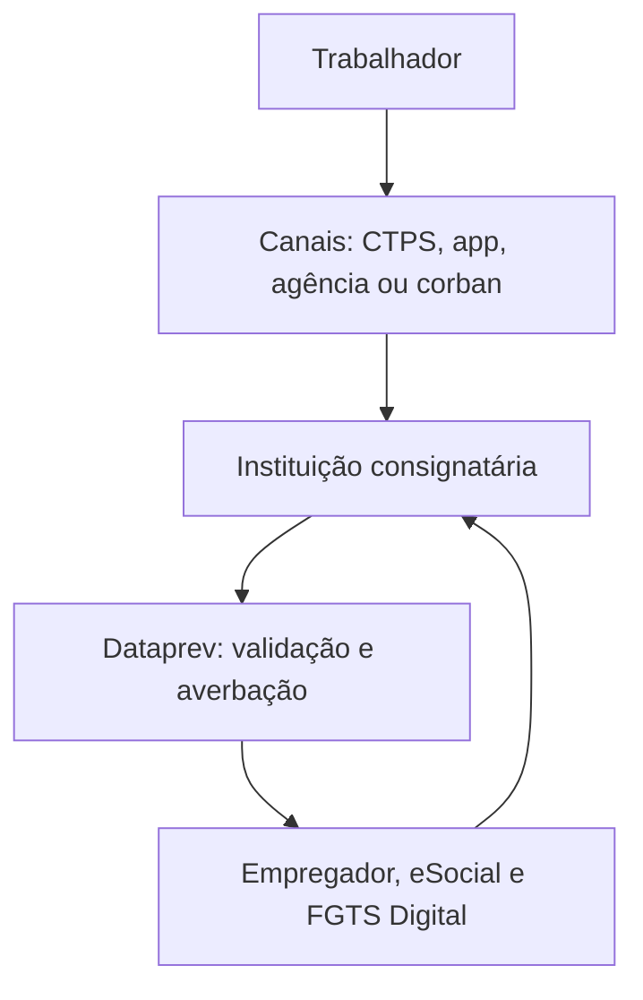

A ideia central é esta:

> **Canal não é a mesma coisa que instituição, e instituição não é a mesma coisa que operador da infraestrutura.**

Quem aparece para o trabalhador pode ser uma fintech ou um corban, mas quem realmente concede o crédito e responde pelo contrato é a **instituição consignatária identificada no contrato**.

## 1. As três camadas do Crédito do Trabalhador

| Camada                           | Exemplos                                            | Função                                                          |
| -------------------------------- | --------------------------------------------------- | --------------------------------------------------------------- |
| **Canais de aquisição**          | CTPS Digital, app, site, agência, WhatsApp, corban  | Onde o trabalhador conhece, simula ou inicia a contratação      |
| **Concessores e intermediários** | Banco, financeira, SCD, SEP, cooperativa, corban    | Quem empresta, intermedeia ou distribui                         |
| **Infraestrutura pública**       | MTE, Dataprev, eSocial, FGTS Digital, Serpro, Caixa | Habilitação, dados, averbação, desconto, recolhimento e repasse |

## 2. O que é cada tipo de instituição

### Instituição consignatária

Não é um tipo societário, mas o **papel central dentro do programa**.

É a pessoa jurídica habilitada pelo MTE para:

* receber ou apresentar propostas;
* consultar elegibilidade e margem com autorização;
* analisar risco;
* definir taxa, prazo e valor;
* assinar o contrato;
* liberar o dinheiro;
* enviar a averbação para a Dataprev;
* receber as parcelas;
* atender o cliente;
* tratar renegociação, portabilidade, quitação e reclamações.

Para operar, precisa estar habilitada pelo MTE, contratar a Dataprev e integrar-se por API. A lista oficial inclui bancos, financeiras, SCDs, SEPs, cooperativas e outras estruturas autorizadas. [Lista atual de instituições habilitadas pelo MTE](https://www.gov.br/trabalho-e-emprego/pt-br/assuntos/credito-do-trabalhador/instituicoes-financeiras-habilitadas/instituicoes-habilitadas).

### Banco

É uma instituição financeira com atuação mais ampla.

Pode oferecer, conforme suas carteiras e autorizações:

* conta-corrente e poupança;
* Pix e pagamentos;
* cartões;
* investimentos;
* seguros em parceria;
* empréstimo pessoal;
* financiamento;
* cheque especial;
* crédito consignado.

No Crédito do Trabalhador, o banco pode ser o **credor direto**, desde que habilitado pelo MTE.

Seu limite:

* não é obrigado a aprovar o crédito;
* define sua política de risco;
* precisa respeitar margem, prazo, taxa aplicável, CET, consentimento e regras de averbação;
* não pode cobrar TAC nem taxas administrativas no Crédito do Trabalhador;
* responde pelos canais e correspondentes que contratar.

O Banco Bradesco S.A., por exemplo, aparece atualmente como instituição habilitada. Nesse cenário:

* Bradesco = instituição consignatária;
* app e agência = canais próprios;
* promotora/corban = canal terceirizado;
* Dataprev = averbação;
* empregador = desconto;
* Caixa = centralização e repasse.

[Definição de banco pelo Banco Central](https://www.bcb.gov.br/estabilidadefinanceira/bancoscaixaseconomicas).

### Financeira — SCFI

A financeira é formalmente uma **Sociedade de Crédito, Financiamento e Investimento**.

É especializada principalmente em:

* empréstimos pessoais;
* crédito ao consumidor;
* financiamento de bens;
* cartões ou produtos de crédito, conforme autorização;
* consignado.

Pode conceder Crédito do Trabalhador diretamente se estiver habilitada pelo MTE.

Diferença principal para o banco:

> A financeira é mais concentrada em crédito. O banco normalmente possui um ecossistema mais amplo de conta, pagamentos, investimentos e relacionamento.

Seu limite:

* não possui automaticamente todas as funcionalidades de um banco;
* atua dentro das autorizações do Banco Central;
* também faz análise de crédito e pode recusar uma proposta;
* precisa seguir todas as regras do programa.

[Definição de financeira pelo Banco Central](https://www.bcb.gov.br/estabilidadefinanceira/scfi).

### Fintech

“Fintech” não define, sozinha, o que a empresa pode fazer. É uma classificação de mercado relacionada ao uso de tecnologia em serviços financeiros.

Juridicamente, uma fintech pode ser:

* banco;
* financeira;
* Sociedade de Crédito Direto — SCD;
* Sociedade de Empréstimo entre Pessoas — SEP;
* instituição de pagamento;
* correspondente digital;
* marketplace;
* empresa exclusivamente tecnológica.

Portanto, a pergunta correta é:

> Qual é a licença, o CNPJ e o papel regulatório dessa fintech?

[Explicação do Banco Central sobre fintechs](https://www.bcb.gov.br/estabilidadefinanceira/fintechs).

### SCD — Sociedade de Crédito Direto

É uma fintech de crédito autorizada pelo Banco Central.

Pode:

* conceder empréstimos e financiamentos digitalmente;
* realizar análise de crédito;
* cobrar créditos;
* atuar por plataforma eletrônica;
* operar Crédito do Trabalhador se habilitada pelo MTE.

Seu limite:

* não funciona como um banco tradicional;
* sua operação é predominantemente eletrônica;
* não pode captar depósitos do público como um banco comercial;
* precisa respeitar as fontes de recursos permitidas pela regulamentação.

A lista do MTE possui diversas SCDs habilitadas.

### SEP — Sociedade de Empréstimo entre Pessoas

É a instituição que conecta credores e tomadores por plataforma digital, no modelo de empréstimo entre pessoas ou investidores.

Pode:

* estruturar a operação;
* analisar o risco;
* conectar credores e tomadores;
* administrar a jornada e os pagamentos;
* participar do Crédito do Trabalhador quando habilitada e dentro do modelo aprovado.

Seu principal limite:

> A SEP não empresta recursos próprios como uma SCD ou um banco. Ela intermedeia os recursos dos credores.

Existem SEPs na lista de instituições habilitadas pelo MTE, mas a estrutura de funding e a identificação do credor continuam seguindo as regras específicas das SEPs.

### Instituição de pagamento — IP ou carteira digital

Uma instituição de pagamento normalmente pode oferecer:

* conta de pagamento;
* carteira digital;
* Pix;
* cartão;
* pagamentos e transferências;
* adquirência e maquininhas.

Em regra, uma IP não pode conceder empréstimos utilizando os recursos dos clientes como se fosse um banco. Ela pode oferecer crédito por meio de parceria com uma instituição financeira, financeira, SCD ou outra entidade autorizada. [O Banco Central explica essa diferença e admite parcerias para concessão de crédito](https://www.bcb.gov.br/meubc/faqs/p/instituicoes-de-pagamento-podem-ter-parceria-com-instituicoes-financeiras-para-concessao-de-credito).

Por isso, quando uma carteira digital apresenta um Crédito CLT, é necessário verificar:

* quem aparece como credor no contrato;
* qual é o CNPJ;
* se a marca está usando uma instituição financeira do mesmo grupo;
* se está atuando como correspondente ou parceira;
* se a entidade responsável está habilitada pelo MTE.

Esse é um bom exemplo de como a **marca comercial pode esconder diferentes papéis regulatórios**.

### Cooperativa de crédito

É uma instituição financeira formada pelos próprios associados.

Pode oferecer aos associados:

* conta;
* pagamentos;
* investimentos;
* empréstimos;
* financiamentos;
* crédito consignado.

Seu limite principal:

> A cooperativa atende seus associados, não o público indistintamente.

Cooperativas habilitadas podem participar do Crédito do Trabalhador. Existe também uma regra especial para cooperativas singulares que já operavam consignado por convênio antes de março de 2025: elas podem manter o modelo anterior, restrito aos associados, mas, se fizerem essa opção, não ofertam aquele crédito na plataforma pública e devem informar o consumo da margem. [Lei nº 15.179/2025](https://www.planalto.gov.br/ccivil_03/_ato2023-2026/2025/lei/l15179.htm).

### Corban — correspondente bancário

O corban não é o dono do empréstimo. Ele é um **canal contratado por uma instituição financeira**.

Pode, conforme o contrato com a instituição:

* prospectar clientes;
* explicar o produto;
* realizar simulações;
* coletar informações e documentos;
* receber e encaminhar propostas;
* apoiar a identificação e formalização;
* acompanhar pendências.

No Crédito do Trabalhador, a operação pode ser realizada por correspondente vinculado à consignatária, mas a instituição continua responsável pelos atos praticados em seu nome. [Portaria MTE nº 435/2025, compilada em 26/06/2026](https://www.gov.br/trabalho-e-emprego/pt-br/assuntos/legislacao/portarias-1/portarias-vigentes-3/word-portaria-mte-no-435-de-20-de-marco-de-2025-compilada-em-26-06-2026.pdf).

O corban não pode:

* emprestar dinheiro próprio como se fosse banco;
* aprovar sozinho o crédito;
* alterar livremente taxa ou condições;
* apresentar-se como funcionário do MTE;
* utilizar dados para outra finalidade;
* cobrar “taxa de liberação” ou “taxa administrativa” no Crédito do Trabalhador;
* usar uma ligação ou gravação de voz como autorização da consignação.

A consignatária responde solidariamente pelos atos dos correspondentes que contratar. O Banco Central também esclarece que a responsabilidade pelo serviço prestado pelo correspondente é da instituição contratante. [Responsabilidade dos correspondentes](https://www.bcb.gov.br/meubc/faqs/p/responsabilidade-dos-correspondentes).

### Promotora de crédito

“Promotora” é uma denominação comercial. Normalmente atua como correspondente, mas o nome não basta.

Pode existir uma promotora que:

* represente um banco;
* represente várias instituições;
* opere call center;
* possua lojas físicas;
* faça aquisição digital;
* trabalhe com agentes ou vendedores.

O seu limite é exatamente o que estiver autorizado no contrato de correspondente. Ela não deve aparecer para o consumidor como se fosse a credora, quando não é.

### Marketplace, HRTech e plataforma de benefícios

Podem funcionar como:

* canal de divulgação;
* comparador de propostas;
* gerador de leads;
* integrador tecnológico;
* correspondente digital;
* parceiro do empregador;
* plataforma de embedded finance.

Não podem conceder o crédito por conta própria sem licença e habilitação. Também não podem usar dados trabalhistas sem base legal, consentimento e finalidade definida.

### FIDC e securitizadora

Normalmente atuam nos bastidores:

* comprando ou financiando carteiras;
* fornecendo funding;
* adquirindo direitos creditórios;
* ajudando a instituição a liberar capacidade de concessão.

Não são, em regra, o canal de contratação do trabalhador. A cessão e a troca de titularidade da carteira devem observar as regras do BCB, CMN e da Plataforma Crédito do Trabalhador.

## 3. Canais e seus limites

| Canal                        | O que faz                                                       | Limite principal                                            |
| ---------------------------- | --------------------------------------------------------------- | ----------------------------------------------------------- |
| **CTPS Digital**             | Solicita e compara propostas de diferentes instituições         | Não aprova nem empresta; instituições respondem pela oferta |
| **App/site da instituição**  | Simulação, consentimento, análise, contratação e acompanhamento | Mostra principalmente a oferta daquela instituição          |
| **Agência**                  | Atendimento assistido e formalização                            | Precisa cumprir identificação, consentimento e biometria    |
| **WhatsApp/call center**     | Aquisição, orientação e acompanhamento                          | Ligação ou voz não vale como autorização da consignação     |
| **Corban físico ou digital** | Simula e encaminha proposta em nome da instituição              | Não é o credor nem decide sozinho                           |
| **Portal de RH/benefícios**  | Divulgação e direcionamento                                     | Empregador não pode impor banco, produto ou condição        |

Na CTPS Digital, o trabalhador autoriza o compartilhamento dos dados necessários, solicita propostas e pode comparar diferentes instituições. As propostas são apresentadas em até 24 horas, e uma nova solicitação pode ser realizada após 24 horas. A contratação também pode começar nos canais próprios das instituições. [Perguntas Frequentes do MTE](https://www.gov.br/trabalho-e-emprego/pt-br/assuntos/credito-do-trabalhador/perguntas-frequentes).

## 4. Quem faz o quê na infraestrutura pública

| Ator                    | Função                                                                                   | O que não faz                                         |
| ----------------------- | ---------------------------------------------------------------------------------------- | ----------------------------------------------------- |
| **Banco Central/CMN**   | Autoriza e supervisiona instituições e define regras financeiras                         | Não aprova o empréstimo individual                    |
| **MTE**                 | Regula o programa, habilita instituições e pode suspender a habilitação                  | Não empresta e não escolhe o banco                    |
| **CGCONSIG**            | Define condições, garantias, taxas e mecanismos de monitoramento                         | Não opera a folha                                     |
| **Dataprev**            | Opera a plataforma, recebe averbações, integra dados e disponibiliza contratos           | Não decide se o crédito será aprovado                 |
| **CTPS Digital**        | Interface do trabalhador para propostas, consentimento e acompanhamento                  | Não é credora                                         |
| **eSocial/CNIS**        | Fonte de dados de vínculo e remuneração e registro da folha                              | Não oferta crédito                                    |
| **Empregador**          | Consulta contrato, desconta, escritura e recolhe                                         | Não escolhe o banco nem aprova o crédito              |
| **Serpro/FGTS Digital** | Geração das guias e processamento do recolhimento                                        | Não concede crédito                                   |
| **Caixa**               | Centraliza valores, repassa às instituições e executa garantias conforme dados recebidos | Não é necessariamente o banco credor daquela operação |

O empregador deve cumprir a escolha feita pelo trabalhador, mesmo sem convênio prévio com a instituição, e não pode criar condições adicionais. A contratação é exclusivamente do trabalhador. [Manual do Empregador — versão 2.1](https://www.gov.br/trabalho-e-emprego/pt-br/assuntos/credito-do-trabalhador/empregador/manual-operacional-do-empregador).

## 5. Limites atuais do Crédito do Trabalhador

### Margem consignável

A soma das parcelas pode comprometer até:

> **35% da remuneração disponível.**

Não significa necessariamente 35% do salário bruto. A base considera remunerações habituais com incidência previdenciária, descontando contribuições, IR e outros descontos compulsórios.

Exemplo:

* remuneração disponível: R$ 3.000;
* soma máxima das parcelas: R$ 1.050;
* valor máximo liberado: dependerá da taxa, prazo, risco e política da instituição.

### Prazo

* Até **96 parcelas** para empregados CLT privados, rurais, domésticos e diretores não empregados com FGTS.
* Até **144 parcelas** em determinadas situações de empregados CLT de empresas públicas e entes abrangidos.

A instituição pode trabalhar com um prazo menor.

### Valor máximo do empréstimo

Não existe um único teto nacional fixado em reais.

O valor depende de:

* margem disponível;
* prazo;
* taxa;
* CET;
* quantidade de contratos;
* estabilidade e características do vínculo;
* política de risco;
* eventuais garantias;
* capacidade de pagamento.

### Taxa de juros

Para as operações com garantias dentro do modelo regulamentado pelo CGCONSIG, a taxa máxima é atualmente de:

> **1,99% ao mês**, tanto pela CTPS Digital quanto pelos canais próprios, com cobertura de garantia de 100% do valor da operação.

A regra dos canais próprios foi atualizada em julho de 2026 pela [Resolução CGCONSIG/MTE nº 4/2026](https://www.gov.br/trabalho-e-emprego/pt-br/acesso-a-informacao/participacao-social/conselhos-e-orgaos-colegiados/cgconsig-comite-gestor-das-operacoes-de-credito-consignado/resolucoes/resolucao-cgconsig-no-4-de-21-de-julho-de-2026.pdf).

Essa taxa máxima está ligada às operações com garantia. Para as demais, não se deve apresentar 1,99% como teto universal; as taxas e o CET são monitorados para identificar práticas abusivas.

### Garantias opcionais

Desde junho de 2026, o trabalhador pode oferecer:

* **35% das verbas rescisórias**, limitado ao saldo devedor;
* até **10% do saldo disponível do FGTS**, nas hipóteses e condições previstas;
* até **100% da multa rescisória do FGTS**.

As garantias podem ser usadas em crédito novo, refinanciamento e portabilidade, mas não em renegociação. [Resolução CGCONSIG/MTE nº 3/2026](https://www.gov.br/trabalho-e-emprego/pt-br/acesso-a-informacao/participacao-social/conselhos-e-orgaos-colegiados/cgconsig-comite-gestor-das-operacoes-de-credito-consignado/resolucoes/resolucao-no-3-de-25-06-2026.pdf).

### Quantidade de contratos

Aqui existe uma atualização importante para o seu case:

* a regra antiga que impedia outra operação no mesmo vínculo foi revogada;
* portanto, não é mais correto resumir como “apenas um contrato por vínculo”;
* a soma das parcelas continua limitada à margem disponível;
* nas operações garantidas, existe limite máximo de **nove contratos garantidos simultaneamente por trabalhador**;
* a garantia de verbas rescisórias fica vinculada a apenas uma operação por vínculo na data do desligamento, salvo exceções de contratos anteriores.

A FAQ do MTE ainda mantém a informação antiga de “um empréstimo por vínculo”. Para o seu case, eu registraria isso como uma **inconsistência entre comunicação pública e regulamentação atual**, que pode gerar dúvida e atendimento.

### Outras proteções

* proibição de TAC e taxas administrativas;
* obrigatoriedade de apresentar CET;
* ausência de carência para início das parcelas;
* autorização expressa e segura;
* voz ou ligação telefônica não servem como autorização;
* direito de desistência em até sete dias após o recebimento do dinheiro, com devolução integral;
* possibilidade de quitação antecipada;
* portabilidade;
* uso dos dados exclusivamente para a finalidade autorizada.

## 6. A frase que resume o ecossistema

> O trabalhador pode chegar pela CTPS, pelo banco ou por um correspondente; porém, quem analisa, concede, assume o risco e responde pelo contrato é a instituição consignatária habilitada. A Dataprev averba, o empregador desconta, o eSocial e o FGTS Digital operacionalizam o recolhimento e a Caixa centraliza o repasse.

Para o seu case de Produto, eu dividiria os concorrentes por **papel regulatório** e, separadamente, por **canal de distribuição**. Isso evita comparar, por exemplo, um banco com um corban como se fossem concorrentes equivalentes. Um disputa concessão e carteira; o outro disputa aquisição e conversão.
