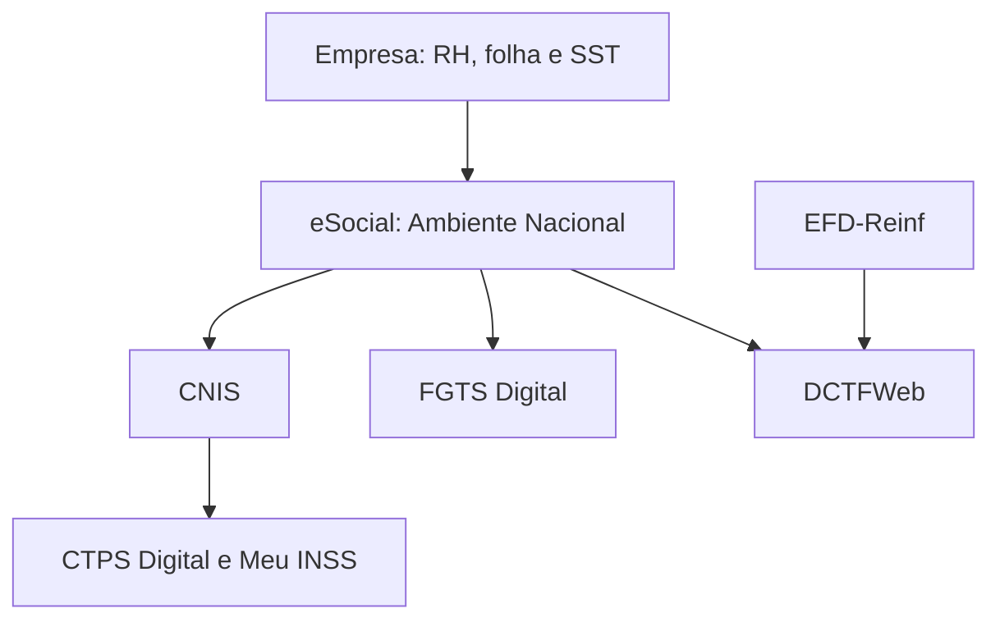
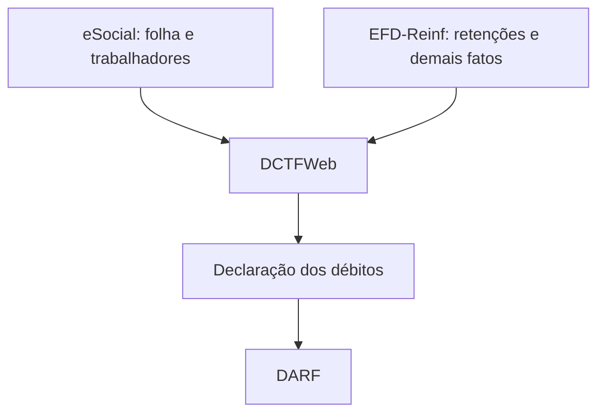
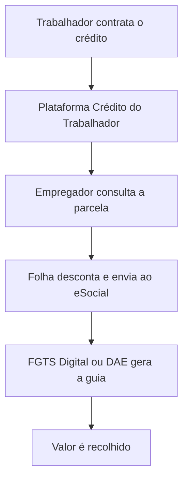

# eSocial — resumo completo para estudo

> **Atualização de referência:** agosto de 2026  
> **Tema:** conceito, finalidade, funcionamento, eventos, órgãos participantes, integrações governamentais, obrigações substituídas e relação com o Crédito do Trabalhador.

---

## 1. Resumo executivo

O **eSocial — Sistema de Escrituração Digital das Obrigações Fiscais, Previdenciárias e Trabalhistas** — é uma plataforma do Governo Federal criada para centralizar o envio das informações relacionadas às relações de trabalho.

Por meio dele, empresas e demais empregadores comunicam ao Governo, de forma digital e padronizada, dados como:

- admissão e desligamento;
- vínculo e contrato de trabalho;
- remuneração e folha de pagamento;
- férias, afastamentos e alterações salariais;
- contribuições previdenciárias e retenções tributárias;
- bases de cálculo do FGTS;
- acidentes de trabalho;
- saúde e segurança do trabalhador;
- processos trabalhistas;
- descontos de empréstimos consignados, como o Crédito do Trabalhador.

O eSocial funciona como uma **porta única de entrada das informações trabalhistas**. Depois de recebidos e validados, seus dados são utilizados por outros ambientes governamentais, como **CNIS, CTPS Digital, Meu INSS, FGTS Digital e DCTFWeb**.

> **Em uma frase:** a empresa informa os dados uma vez ao eSocial, e os sistemas governamentais competentes utilizam essas informações para registrar direitos, calcular obrigações, gerar guias e apoiar a fiscalização.

---

## 2. O que é o eSocial?

O eSocial foi instituído pelo **Decreto nº 8.373/2014** e integra o **Sistema Público de Escrituração Digital — SPED**.

Ele não criou novos direitos trabalhistas nem um novo regime tributário. O que mudou foi a maneira como o empregador presta as informações ao Governo.

Antes do eSocial, uma mesma informação podia ser enviada separadamente para diferentes órgãos, por meio de declarações, formulários, arquivos e sistemas distintos. Isso aumentava a possibilidade de:

- duplicidade de informações;
- divergências entre declarações;
- erros cadastrais;
- retrabalho;
- atrasos;
- dificuldade de fiscalização e cruzamento de dados.

Com o eSocial, as informações passam a seguir um **leiaute único e padronizado**, sendo armazenadas em um Ambiente Nacional e compartilhadas conforme a competência de cada órgão público.

---

## 3. Para que serve?

O eSocial tem cinco finalidades principais:

1. **Centralizar informações:** criar um canal único para o envio de dados trabalhistas, previdenciários e tributários.
2. **Reduzir redundâncias:** evitar que o empregador envie a mesma informação para vários órgãos.
3. **Garantir direitos:** melhorar o registro de vínculos, remunerações, contribuições e condições de trabalho.
4. **Automatizar obrigações:** permitir que outros sistemas calculem débitos e gerem documentos a partir das informações recebidas.
5. **Aumentar a qualidade e a fiscalização:** facilitar a identificação de inconsistências, omissões e divergências.

### Benefícios para a empresa

- padronização dos processos;
- redução de declarações separadas;
- menor duplicidade de dados;
- integração entre RH, Departamento Pessoal, Contabilidade, Fiscal e SST;
- maior rastreabilidade das informações enviadas;
- automatização de cálculos, declarações e guias.

### Benefícios para o trabalhador

- maior transparência sobre o contrato de trabalho;
- atualização da CTPS Digital;
- registro de remunerações e contribuições no CNIS;
- melhor comprovação de direitos previdenciários;
- acesso ao PPP Eletrônico;
- maior controle sobre admissões, desligamentos e condições de trabalho.

### Benefícios para o Governo

- melhor qualidade das informações;
- redução de declarações redundantes;
- cruzamento automatizado de dados;
- maior capacidade de fiscalização;
- apoio à formulação de políticas públicas;
- melhor controle das obrigações trabalhistas, previdenciárias e tributárias.

---

## 4. Quem participa do ecossistema?

O eSocial é uma iniciativa conjunta de órgãos e entidades federais relacionados às relações de trabalho, à previdência, à tributação e ao FGTS.

| Órgão ou entidade | Papel no ecossistema |
|---|---|
| **Ministério do Trabalho e Emprego — MTE** | Fiscalização trabalhista, relações de trabalho, políticas de emprego e FGTS Digital |
| **Receita Federal do Brasil — RFB** | Informações tributárias, previdenciárias, IRRF e DCTFWeb |
| **Instituto Nacional do Seguro Social — INSS** | Concessão de benefícios e utilização das informações previdenciárias registradas no CNIS |
| **Dataprev** | Processamento tecnológico de informações, incluindo a internalização de eventos no CNIS |
| **Caixa Econômica Federal** | Agente operador do FGTS dentro do ecossistema governamental |

---

## 5. Como funciona na prática?

O funcionamento pode ser resumido em seis etapas:

1. O empregador registra uma ocorrência em seu sistema, como uma admissão, remuneração ou desligamento.
2. O sistema de RH, folha ou SST transforma a informação no leiaute exigido pelo eSocial.
3. O evento é transmitido pelo webservice ou preenchido diretamente em um módulo web.
4. O eSocial valida a estrutura, as regras e a consistência do evento.
5. Se o evento for aceito, o sistema devolve um recibo de entrega.
6. A informação passa a ser utilizada pelos órgãos e sistemas governamentais responsáveis.

O envio normalmente acontece de duas formas:

- **integração por webservice:** utilizada por empresas que possuem sistemas próprios, ERPs ou sistemas de folha integrados;
- **módulos web do eSocial:** utilizados para preenchimento manual ou simplificado, conforme o tipo de empregador.

---

## 6. O que são os eventos do eSocial?

Cada informação enviada ao eSocial é chamada de **evento**. Os eventos são organizados em grupos.

### 6.1 Evento inicial

Identifica o empregador e apresenta seus dados básicos.

| Exemplo | Finalidade |
|---|---|
| **S-1000** | Informações do empregador, contribuinte ou órgão público |

### 6.2 Eventos de tabelas

Estruturam os dados utilizados nos demais eventos.

Exemplos de informações:

- estabelecimentos e obras;
- rubricas da folha;
- lotações tributárias;
- processos administrativos e judiciais.

| Exemplo | Finalidade |
|---|---|
| **S-1005** | Estabelecimentos, obras ou unidades de órgãos públicos |
| **S-1010** | Tabela de rubricas da folha de pagamento |
| **S-1020** | Tabela de lotações tributárias |

### 6.3 Eventos não periódicos

São enviados quando ocorre determinado fato na vida profissional do trabalhador.

| Exemplo | Finalidade |
|---|---|
| **S-2190** | Registro preliminar de trabalhador |
| **S-2200** | Admissão e cadastramento inicial do vínculo |
| **S-2206** | Alteração contratual |
| **S-2210** | Comunicação de acidente de trabalho — CAT |
| **S-2220** | Monitoramento da saúde do trabalhador |
| **S-2230** | Afastamento temporário |
| **S-2240** | Condições ambientais e exposição a agentes nocivos |
| **S-2299** | Desligamento |
| **S-2399** | Término de trabalhador sem vínculo de emprego |

### 6.4 Eventos periódicos

São relacionados principalmente à folha de pagamento e possuem uma competência definida.

| Exemplo | Finalidade |
|---|---|
| **S-1200** | Remuneração do trabalhador |
| **S-1210** | Pagamentos de rendimentos do trabalho |
| **S-1298** | Reabertura dos eventos periódicos |
| **S-1299** | Fechamento dos eventos periódicos |

### 6.5 Eventos de processos trabalhistas

Registram informações decorrentes de decisões e acordos trabalhistas.

| Exemplo | Finalidade |
|---|---|
| **S-2500** | Processo trabalhista |
| **S-2501** | Tributos decorrentes de processo trabalhista |

---

## 7. Com quais sistemas do Governo o eSocial se integra?

É importante diferenciar **integração**, **consumo de dados**, **complementaridade** e **substituição de obrigação**.

### 7.1 CNIS — Cadastro Nacional de Informações Sociais

O CNIS recebe informações de vínculos, remunerações e contribuições transmitidas ao eSocial.

Esses dados formam parte do histórico previdenciário do trabalhador e são utilizados pelo INSS na análise de benefícios, como:

- aposentadoria;
- auxílio por incapacidade;
- salário-maternidade;
- pensão por morte;
- comprovação de vínculos e contribuições.

O CNIS é uma das integrações centrais porque também fornece informações para outros serviços governamentais.

### 7.2 CTPS Digital — Carteira de Trabalho Digital

A CTPS Digital apresenta ao trabalhador informações relacionadas ao contrato de trabalho.

O fluxo simplificado é:

1. a empresa envia a admissão ou alteração ao eSocial;
2. a informação é processada e incorporada ao CNIS;
3. a CTPS Digital consulta essa base;
4. o trabalhador visualiza o vínculo no aplicativo.

Podem aparecer informações como:

- empregador;
- data de admissão;
- cargo;
- salário;
- alterações contratuais;
- férias;
- desligamento.

Portanto, a CTPS Digital geralmente não deve ser entendida como uma base independente alimentada manualmente pela empresa. O empregador cumpre a obrigação enviando os eventos adequados ao eSocial.

### 7.3 Meu INSS

O Meu INSS permite ao trabalhador consultar informações previdenciárias provenientes do CNIS e de outros sistemas do INSS.

Entre as informações relacionadas ao eSocial estão:

- vínculos empregatícios;
- remunerações;
- contribuições;
- extrato CNIS;
- PPP Eletrônico.

### 7.4 PPP Eletrônico

O **Perfil Profissiográfico Previdenciário — PPP** é formado a partir das informações de Saúde e Segurança do Trabalho declaradas no eSocial, especialmente eventos como:

- S-2210 — acidente de trabalho;
- S-2220 — monitoramento da saúde;
- S-2240 — condições ambientais e agentes nocivos.

O documento é utilizado para registrar o histórico laboral relacionado à exposição a agentes nocivos e pode apoiar a análise de aposentadoria especial.

O trabalhador pode consultar o PPP Eletrônico pelo Meu INSS.

### 7.5 FGTS Digital

O FGTS Digital utiliza informações declaradas no eSocial como base para:

- identificar remunerações;
- calcular valores de FGTS;
- reconhecer desligamentos;
- formar débitos;
- gerar guias mensais e rescisórias;
- recolher parcelas do Crédito do Trabalhador, quando aplicável.

Isso significa que o valor não deve ser corrigido diretamente apenas no FGTS Digital quando a origem do erro está na folha. Primeiro, o empregador precisa corrigir ou retificar o evento correspondente no eSocial.

> **Regra mental:** o eSocial informa a base; o FGTS Digital calcula e recolhe.

### 7.6 DCTFWeb

A **Declaração de Débitos e Créditos Tributários Federais Web — DCTFWeb** recebe os totalizadores gerados pelo eSocial após o fechamento da escrituração.

Ela é utilizada para:

- consolidar débitos previdenciários e tributários;
- permitir a vinculação de créditos;
- formalizar a declaração dos débitos;
- gerar o DARF para pagamento.

O fluxo simplificado é:

1. a empresa envia a folha ao eSocial;
2. o eSocial apura os totalizadores;
3. a empresa transmite o fechamento;
4. os débitos são enviados à DCTFWeb;
5. a empresa confere a declaração e emite o DARF.

### 7.7 EFD-Reinf

A **EFD-Reinf** é uma escrituração complementar ao eSocial. Ela não deve ser tratada como uma obrigação substituída pelo eSocial nem como se recebesse todos os seus eventos.

De maneira simplificada:

- o **eSocial** concentra informações relacionadas ao trabalho e à folha de pagamento;
- a **EFD-Reinf** concentra determinadas retenções e informações não abrangidas pela folha;
- os dois ambientes enviam seus totalizadores para a **DCTFWeb**.

### 7.8 Portal Emprega Brasil e Plataforma Crédito do Trabalhador

No Crédito do Trabalhador, o Portal Emprega Brasil e os serviços disponibilizados pelo MTE permitem ao empregador consultar as parcelas dos contratos de empréstimo consignado que devem ser descontadas.

As informações podem ser obtidas pelo portal ou por integração automatizada, conforme a solução adotada pelo empregador.

O empregador utiliza esses dados para:

- lançar a parcela na folha de pagamento;
- efetuar o desconto no salário;
- informar o desconto ao eSocial;
- gerar o recolhimento pelo FGTS Digital ou DAE, conforme o tipo de empregador.

### 7.9 DAE do eSocial Doméstico

No módulo do empregador doméstico, o eSocial também permite gerar o **Documento de Arrecadação do eSocial — DAE**, que reúne em uma única guia os valores aplicáveis, como:

- contribuição previdenciária;
- FGTS;
- seguro contra acidentes;
- Imposto de Renda, quando houver;
- parcela de consignado, quando aplicável.

---

## 8. Visão consolidada das integrações

| Sistema governamental | Tipo de relação | Informação utilizada | Resultado principal |
|---|---|---|---|
| **CNIS** | Recebe e processa dados | Vínculos, remunerações e contribuições | Histórico previdenciário |
| **CTPS Digital** | Exibe dados processados pelo CNIS | Admissão, contrato, cargo, salário e desligamento | Carteira de trabalho atualizada |
| **Meu INSS** | Consulta dados previdenciários | CNIS e informações previdenciárias | Serviços, extratos e benefícios |
| **PPP Eletrônico** | Gerado com dados de SST | Saúde, acidentes e exposição a agentes nocivos | Histórico ocupacional eletrônico |
| **FGTS Digital** | Usa o eSocial como base | Remunerações, desligamentos e descontos | Débitos e guias de FGTS |
| **DCTFWeb** | Recebe totalizadores | Contribuições previdenciárias e tributos | Declaração e DARF |
| **EFD-Reinf** | Complementar ao eSocial | Retenções e fatos não abrangidos pela folha | Totalizadores enviados à DCTFWeb |
| **Emprega Brasil / Crédito do Trabalhador** | Participa de um fluxo integrado de negócio | Contratos e parcelas de consignado | Informação para desconto em folha |
| **DAE do eSocial Doméstico** | Módulo de arrecadação | Folha, tributos, FGTS e descontos | Guia unificada |

---

## 9. Integração não é a mesma coisa que substituição

A página oficial “Conheça o eSocial”, originalmente publicada em 2017 e atualizada em 2019, apresenta uma relação de 15 obrigações que seriam unificadas ou substituídas.

Essa lista é importante historicamente, mas não significa que o eSocial possua uma integração direta e idêntica com 15 sistemas.

Na lista existem:

- sistemas;
- declarações;
- guias de recolhimento;
- documentos trabalhistas;
- livros e registros;
- obrigações acessórias.

Portanto, é necessário analisar cada item conforme sua natureza e o estágio atual de substituição.

---

## 10. Obrigações, documentos e declarações substituídos ou alimentados pelo eSocial

| Item | Significado | O que ocorreu com o eSocial |
|---|---|---|
| **CAGED** | Cadastro Geral de Empregados e Desempregados | Admissões e desligamentos passaram a ser informados pelo eSocial para os empregadores obrigados |
| **RAIS** | Relação Anual de Informações Sociais | Informações passaram a ser obtidas a partir do eSocial para os grupos abrangidos |
| **LRE** | Livro de Registro de Empregados | Pode ser substituído pelo registro eletrônico realizado por meio do eSocial, conforme as regras aplicáveis |
| **CTPS** | Carteira de Trabalho e Previdência Social | Anotações do vínculo passaram a ser cumpridas pelo eSocial e exibidas na CTPS Digital |
| **CAT** | Comunicação de Acidente de Trabalho | Passou a ser informada pelo evento S-2210 |
| **PPP** | Perfil Profissiográfico Previdenciário | O PPP Eletrônico é formado com os eventos de SST do eSocial |
| **GFIP** | Guia de Recolhimento do FGTS e de Informações à Previdência Social | Foi substituída gradualmente por eSocial, DCTFWeb e FGTS Digital, conforme a natureza da informação |
| **GPS** | Guia da Previdência Social | Em diversos casos, o recolhimento passou a ser feito por DARF gerado na DCTFWeb |
| **GRF** | Guia de Recolhimento do FGTS | Foi substituída pelas guias geradas no FGTS Digital para os empregadores abrangidos |
| **DIRF** | Declaração do Imposto de Renda Retido na Fonte | Informações passaram a ser prestadas pelo eSocial e pela EFD-Reinf, conforme sua natureza |
| **Folha de pagamento** | Registro das remunerações e descontos | Passou a ser escriturada digitalmente por meio dos eventos periódicos |
| **QHT** | Quadro de Horário de Trabalho | Informações de jornada e horários são tratadas conforme as obrigações e eventos aplicáveis |
| **MANAD** | Manual Normativo de Arquivos Digitais | Parte das informações e da fiscalização digital foi absorvida pelo novo modelo de escrituração |
| **CD** | Comunicação de Dispensa | Informações relacionadas ao desligamento passaram a ser transmitidas pelo eSocial |
| **DCTF/DCTFWeb** | Declaração de débitos tributários | A DCTFWeb passou a receber automaticamente totalizadores do eSocial e da EFD-Reinf |

> **Atenção:** a substituição pode variar conforme o período, o grupo de obrigados, o tipo de empregador e a natureza da obrigação. A lista histórica da página oficial não deve ser interpretada como se todos os itens tivessem sido substituídos de uma só vez e da mesma maneira.

---

## 11. Sistemas internos das empresas impactados

Embora o eSocial seja uma plataforma governamental, sua implantação exige integração e consistência entre diferentes sistemas internos da empresa.

| Sistema ou área interna | Informações relacionadas ao eSocial |
|---|---|
| **Cadastro de RH** | Dados pessoais, cargo, salário, estabelecimento e contrato |
| **Folha de pagamento** | Remuneração, descontos, rubricas, encargos e fechamento |
| **Controle de ponto** | Jornada, horas extras, faltas e reflexos na remuneração |
| **Benefícios** | Descontos e verbas que podem aparecer na folha |
| **SST e medicina do trabalho** | CAT, ASO, exames, riscos e agentes nocivos |
| **Fiscal e tributário** | IRRF, contribuições e integração com DCTFWeb e EFD-Reinf |
| **Contabilidade** | Conciliação da folha, encargos, provisões e pagamentos |
| **Financeiro** | Pagamento de DARF, FGTS, DAE e demais obrigações |
| **Gestão de consignados** | Consulta, desconto e conciliação das parcelas de empréstimos |

Uma inconsistência no cadastro ou na folha pode se propagar para vários ambientes governamentais. Por isso, o eSocial exige governança de dados e integração entre áreas.

---

## 12. Exemplos práticos de funcionamento

### 12.1 Admissão de um trabalhador

1. O RH cadastra o trabalhador.
2. A empresa envia o evento de admissão ao eSocial.
3. O evento é validado.
4. Os dados são processados no CNIS.
5. O vínculo aparece na CTPS Digital.
6. A informação passa a compor o histórico trabalhista e previdenciário.

### 12.2 Fechamento da folha de pagamento

1. A empresa calcula salários, descontos e encargos.
2. Envia os eventos de remuneração e pagamento ao eSocial.
3. Realiza o fechamento dos eventos periódicos.
4. O eSocial gera os totalizadores.
5. A DCTFWeb recebe os débitos previdenciários e tributários.
6. O FGTS Digital recebe as bases de FGTS.
7. A empresa emite o DARF e a guia de FGTS nos respectivos sistemas.

### 12.3 Acidente de trabalho

1. A empresa registra o acidente.
2. O evento S-2210 é enviado ao eSocial.
3. A informação é disponibilizada aos órgãos competentes.
4. O histórico pode compor os registros previdenciários e de SST do trabalhador.

### 12.4 Alteração salarial

1. O RH altera o salário no sistema interno.
2. A alteração contratual é enviada ao eSocial.
3. O novo salário passa a ser considerado nos eventos de folha.
4. A informação pode aparecer na CTPS Digital após o processamento.

---

## 13. Relação do eSocial com o Crédito do Trabalhador

O **Crédito do Trabalhador** é um programa de empréstimo consignado para trabalhadores do setor privado. As parcelas são descontadas da remuneração e recolhidas pelo empregador.

O eSocial é uma peça central do processo porque registra o desconto efetuado na folha.

### 13.1 Fluxo simplificado

### 13.2 Passo a passo

1. O trabalhador contrata o empréstimo com uma instituição financeira habilitada.
2. As informações do contrato e da parcela são disponibilizadas ao empregador.
3. O empregador consulta os dados pelo Portal Emprega Brasil ou por integração automatizada.
4. A parcela é lançada no sistema de folha.
5. O valor é descontado da remuneração do trabalhador, respeitando as regras aplicáveis.
6. O empregador escritura o desconto no evento de remuneração do eSocial.
7. O FGTS Digital recebe a informação e permite gerar a guia com os valores de FGTS e consignado.
8. Para os casos tratados pelo módulo simplificado, o recolhimento pode ocorrer pelo DAE.
9. O empregador paga a guia dentro do prazo.
10. Os valores são direcionados para a liquidação das parcelas perante as instituições consignatárias.

### 13.3 Rubrica utilizada

No fluxo do Crédito do Trabalhador, o desconto deve ser escriturado com a parametrização adequada no sistema de folha. A orientação oficial prevê, para a rubrica de desconto do empréstimo consignado:

- natureza da rubrica: **9253**;
- tipo: **desconto**;
- incidência de FGTS utilizada no fluxo: **31**, conforme a orientação operacional aplicável.

Uma parametrização incorreta pode impedir que o valor seja reconhecido corretamente pelo FGTS Digital.

### 13.4 Papel de cada sistema no Crédito do Trabalhador

| Sistema | Responsabilidade principal |
|---|---|
| **CTPS Digital / canal do trabalhador** | Permitir a jornada do trabalhador dentro do programa |
| **Plataforma Crédito do Trabalhador** | Manter informações dos contratos e parcelas |
| **Portal Emprega Brasil / webservice** | Disponibilizar as parcelas ao empregador |
| **Sistema de folha** | Lançar e calcular o desconto salarial |
| **eSocial** | Escriturar oficialmente o desconto realizado na folha |
| **FGTS Digital** | Gerar a guia de recolhimento do FGTS e do consignado |
| **DAE** | Realizar o recolhimento nos casos tratados pelos módulos simplificados |
| **Instituição financeira** | Conceder o crédito e receber a liquidação da parcela |

> **Resumo do fluxo:** a Plataforma Crédito do Trabalhador informa a parcela; a folha calcula e desconta; o eSocial escritura; e o FGTS Digital ou DAE viabiliza o recolhimento.

---

## 14. Principais riscos e pontos de atenção

### Qualidade cadastral

- CPF incorreto;
- dados contratuais divergentes;
- cargo ou estabelecimento inadequado;
- datas inconsistentes;
- trabalhador vinculado incorretamente.

### Parametrização da folha

- rubrica com natureza incorreta;
- incidência previdenciária, tributária ou de FGTS errada;
- desconto enviado com valor diferente da folha;
- falta de integração entre a folha e o eSocial.

### Prazos

- admissão enviada fora do prazo;
- desligamento não informado;
- fechamento da folha atrasado;
- CAT ou eventos de SST enviados fora do prazo;
- parcela consignada descontada, mas não recolhida.

### Integração entre sistemas

- evento aceito no eSocial, mas ainda não processado no sistema consumidor;
- divergência entre eSocial, CNIS e CTPS Digital;
- retificação feita na folha, mas não transmitida ao eSocial;
- erro na origem sendo tratado apenas no FGTS Digital ou na DCTFWeb;
- ausência de conciliação entre folha, guia e pagamento.

### Segurança e privacidade

O eSocial trata dados pessoais, trabalhistas, financeiros e de saúde. Por isso, os processos relacionados devem observar:

- controle de acesso;
- proteção de dados pessoais;
- rastreabilidade das alterações;
- segregação de funções;
- guarda de recibos e evidências;
- conformidade com a LGPD.

---

## 15. Como analisar um erro no ecossistema

Quando uma informação estiver incorreta em um sistema governamental, a primeira pergunta deve ser:

> **Qual é o sistema de origem do dado?**

Exemplos:

| Problema observado | Possível origem a verificar |
|---|---|
| Admissão não aparece na CTPS Digital | Evento de admissão, processamento no eSocial e internalização no CNIS |
| Remuneração não aparece no CNIS | Evento periódico e fechamento da competência |
| Guia do FGTS com valor incorreto | Remuneração, desligamento ou rubrica informada no eSocial |
| Débito incorreto na DCTFWeb | Totalizadores do eSocial ou da EFD-Reinf |
| PPP incompleto | Eventos de SST enviados ao eSocial |
| Parcela do Crédito do Trabalhador não aparece na guia | Consulta da parcela, lançamento na folha, rubrica e escrituração no eSocial |

Corrigir apenas o sistema final pode não resolver o problema. Em muitos casos, é necessário corrigir o dado no sistema interno e retificar o evento no eSocial para que a atualização percorra toda a cadeia.

---

## 16. Glossário essencial

| Termo | Definição simplificada |
|---|---|
| **Escrituração** | Registro oficial e estruturado de uma informação em sistema governamental |
| **Evento** | Arquivo ou conjunto de dados enviado ao eSocial para comunicar determinado fato |
| **Competência** | Mês de referência da remuneração, desconto ou obrigação |
| **Rubrica** | Código que identifica uma verba da folha, como salário, adicional ou desconto |
| **Incidência** | Indicação de como a rubrica participa do cálculo de FGTS, INSS ou Imposto de Renda |
| **Retificação** | Correção de uma informação anteriormente transmitida |
| **Fechamento** | Confirmação de que os eventos periódicos de uma competência foram concluídos |
| **Totalizador** | Resultado calculado pelo eSocial a partir dos eventos enviados |
| **CNIS** | Base nacional que reúne vínculos, remunerações e contribuições sociais |
| **DCTFWeb** | Sistema que consolida e declara determinados débitos tributários e previdenciários |
| **FGTS Digital** | Sistema que utiliza dados do eSocial para gestão de débitos e geração de guias do FGTS |
| **EFD-Reinf** | Escrituração complementar ao eSocial para retenções e outros fatos fiscais |
| **SST** | Saúde e Segurança do Trabalho |
| **PPP** | Histórico laboral relacionado às condições de trabalho e exposição a riscos |
| **DAE** | Documento de Arrecadação do eSocial utilizado nos módulos simplificados aplicáveis |
| **Webservice** | Integração que permite a troca automatizada de informações entre sistemas |

---

## 17. Resumo para memorização

1. O eSocial é o **canal central de envio** das informações trabalhistas, previdenciárias e tributárias.
2. A empresa envia dados de cadastro, vínculo, folha, desligamento e SST por meio de **eventos**.
3. O **CNIS** recebe vínculos e remunerações; a **CTPS Digital** e o **Meu INSS** apresentam parte dessas informações.
4. O **FGTS Digital** usa as bases declaradas no eSocial para gerar débitos e guias.
5. A **DCTFWeb** recebe os totalizadores do eSocial e da EFD-Reinf para declarar débitos e emitir o DARF.
6. A **EFD-Reinf complementa** o eSocial; ela não é simplesmente substituída por ele.
7. CAGED, RAIS, GFIP, CAT, PPP e outros itens são obrigações ou documentos que foram substituídos ou passaram a ser alimentados pelos dados do eSocial.
8. No **Crédito do Trabalhador**, a parcela é consultada pelo empregador, descontada na folha, escriturada no eSocial e recolhida pelo FGTS Digital ou DAE.
9. Um erro na origem pode afetar diversos sistemas governamentais.
10. O eSocial não criou novos tributos: ele mudou e padronizou a forma de prestar informações ao Governo.

---

## 18. Fontes oficiais para aprofundamento

- [Conheça o eSocial — Governo Federal](https://www.gov.br/esocial/pt-br/centrais-de-conteudo/conheca-o-esocial)
- [Portal oficial do eSocial](https://www.gov.br/esocial/pt-br)
- [Manual de Orientação do eSocial — MOS](https://www.gov.br/esocial/pt-br/documentacao-tecnica/manuais)
- [Integração entre eSocial, CNIS e CTPS Digital](https://www.gov.br/esocial/pt-br/noticias/cnis-passa-a-ter-atualizacao-em-tempo-real-com-dados-do-esocial)
- [PPP Eletrônico e eventos de SST](https://www.gov.br/esocial/pt-br/noticias/disponibilizacao-do-perfil-profissiografico-previdenciario-ppp-eletronico)
- [FGTS Digital — perguntas frequentes](https://www.gov.br/trabalho-e-emprego/pt-br/servicos/empregador/fgtsdigital/perguntas-frequentes)
- [Integração do eSocial e da EFD-Reinf com a DCTFWeb](https://www.gov.br/esocial/pt-br/noticias/receita-federal/dctfweb-entra-em-producao-e-substituira-a-gfip)
- [Crédito do Trabalhador — portal oficial](https://www.gov.br/trabalho-e-emprego/pt-br/assuntos/credito-do-trabalhador)
- [Operacionalização do consignado no FGTS Digital](https://www.gov.br/trabalho-e-emprego/pt-br/servicos/empregador/fgtsdigital/comunicados/fgts-digital-esta-preparado-para-recebimento-de-pagamentos-do-consignado-do-programa-credito-do-trabalhador)
- [Obrigações substituídas pelo eSocial](https://www.gov.br/esocial/pt-br/noticias/esocial-passa-a-substituir-livro-de-registro-de-empregados)

---

> **Nota de estudo:** a página “Conheça o eSocial” é uma fonte oficial relevante, mas seu conteúdo foi publicado durante a implantação do sistema e utiliza informações e terminologias daquele período. Para regras operacionais, leiautes, eventos e prazos atuais, consulte também o Portal do eSocial, o MOS e os comunicados oficiais mais recentes.
