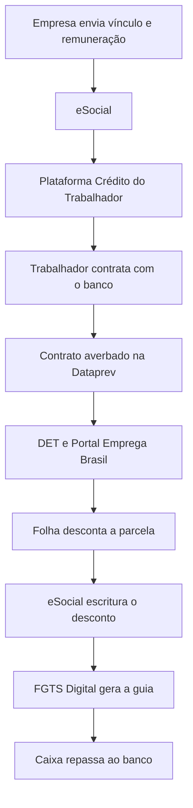
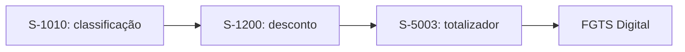

Considerando o **consignado privado do programa Crédito do Trabalhador**, o eSocial participa de dois momentos:

1. **antes da contratação:** fornece informações de vínculo e remuneração usadas para elegibilidade e cálculo da margem;
2. **depois da contratação:** registra oficialmente quanto foi descontado na folha e envia essa informação ao FGTS Digital.

## Fluxo completo

## 1. Empresa envia os dados ao eSocial

Todos os meses, a empresa já informa ao eSocial:

* vínculo ativo;
* categoria do trabalhador;
* salário;
* remuneração;
* afastamentos;
* desligamentos;
* contribuições e bases de FGTS.

Essas informações ajudam a Plataforma Crédito do Trabalhador a identificar se a pessoa possui vínculo elegível e estimar sua margem para contratação.

## 2. Trabalhador solicita o empréstimo

O trabalhador pode iniciar a jornada pela CTPS Digital ou por canais disponibilizados pelas instituições financeiras habilitadas.

A plataforma utiliza as informações governamentais para apresentar às instituições:

* existência de vínculo ativo;
* remuneração de referência;
* margem consignável;
* dados necessários para formular a proposta.

A empresa empregadora não escolhe o banco nem participa da decisão de contratação.

## 3. Instituição financeira apresenta a proposta

A instituição financeira:

1. recebe a solicitação;
2. analisa o trabalhador;
3. apresenta taxa, valor, prazo, parcela e CET;
4. realiza as validações;
5. formaliza o contrato;
6. libera o dinheiro, após aprovação e conclusão da contratação.

## 4. Contrato é averbado

Depois da contratação, o contrato é registrado na **Plataforma Crédito do Trabalhador**, administrada pela Dataprev.

Esse registro é chamado de **averbação**.

> Averbar significa registrar oficialmente que existe um contrato e reservar sua parcela dentro da margem consignável do trabalhador.

A competência da primeira parcela depende da data de averbação. A regra considera o intervalo entre o dia 21 do mês anterior e o dia 20 do mês corrente. [Manual do Empregador — versão 2.1](https://www.gov.br/trabalho-e-emprego/pt-br/assuntos/credito-do-trabalhador/empregador/manual-operacional-do-empregador)

## 5. Empregador recebe um aviso no DET

O **Domicílio Eletrônico Trabalhista — DET** envia um aviso informando que existem contratos de consignado relacionados a trabalhadores da empresa.

O DET funciona apenas como uma **notificação**. Ele não contém necessariamente todo o detalhamento necessário para calcular a folha.

## 6. Empregador consulta as parcelas

Entre os dias **21 e 25 de cada mês**, o empregador deve consultar as parcelas da próxima competência no:

* Portal Emprega Brasil; ou
* webservice/API integrado ao sistema de folha.

O arquivo apresenta informações como:

* CPF do trabalhador;
* competência do desconto;
* valor da parcela;
* número do contrato;
* código da instituição financeira;
* dados necessários para a escrituração;
* informações de garantia, quando aplicável.

Essas informações são atualizadas mensalmente. A empresa não deve simplesmente reutilizar o arquivo do mês anterior, pois podem ocorrer portabilidade, renegociação, quitação ou alteração da parcela.

## 7. Empresa calcula a remuneração disponível

Antes de descontar, a folha verifica quanto pode ser comprometido naquele mês.

De forma simplificada:

> **Remuneração disponível = vencimentos considerados − descontos obrigatórios e compulsórios**

Depois:

> **Limite mensal do consignado = até 35% da remuneração disponível**

### Exemplo

| Cálculo                                     |    Valor |
| ------------------------------------------- | -------: |
| Salário e demais verbas consideradas        | R$ 4.000 |
| INSS, IRRF, faltas e descontos considerados |   R$ 600 |
| Remuneração disponível                      | R$ 3.400 |
| Limite de 35%                               | R$ 1.190 |
| Parcela contratada                          |   R$ 800 |
| Valor que pode ser descontado               |   R$ 800 |

Se a parcela for maior que o limite daquele mês, pode ocorrer **desconto parcial**.

Por exemplo:

* parcela contratada: R$ 800;
* limite disponível no mês: R$ 500;
* empresa desconta: R$ 500;
* trabalhador precisa ser informado;
* o valor restante deve ser tratado com a instituição financeira.

## 8. Folha utiliza a rubrica do consignado

A empresa precisa ter uma rubrica cadastrada para identificar o desconto:

| Configuração              | Valor    |
| ------------------------- | -------- |
| Tipo                      | Desconto |
| Natureza no eSocial       | `9253`   |
| Incidência de FGTS        | `31`     |
| Incidência previdenciária | `00`     |
| Incidência de IRRF        | `9`      |

A rubrica é cadastrada no evento:

* **S-1010 — Tabela de Rubricas**.

No lançamento mensal, também são informados:

* valor efetivamente descontado;
* código da instituição financeira;
* número do contrato;
* informações adicionais, quando necessárias.

## 9. Empresa envia o desconto ao eSocial

O evento utilizado depende da situação:

| Situação                           | Evento                    |
| ---------------------------------- | ------------------------- |
| Folha mensal normal                | **S-1200 — Remuneração**  |
| Desligamento de empregado          | **S-2299 — Desligamento** |
| Término de trabalhador sem vínculo | **S-2399 — Término**      |

O ponto mais importante é:

> O eSocial deve receber o valor que foi efetivamente descontado do trabalhador, e não necessariamente o valor integral originalmente previsto no contrato.

Se a parcela era R$ 800, mas a folha só conseguiu descontar R$ 500 por causa da margem, o eSocial deve receber R$ 500.

## 10. eSocial gera o totalizador

Depois de receber a remuneração, o eSocial gera o evento:

* **S-5003 — Informações do FGTS por trabalhador**.

Esse totalizador reúne as informações que serão utilizadas pelo FGTS Digital, inclusive o desconto do consignado.

## 11. FGTS Digital gera a guia

O FGTS Digital lê o totalizador do eSocial e cria o débito do consignado.

A empresa pode emitir uma guia contendo:

* FGTS;
* parcelas do consignado;
* ou os débitos separadamente, conforme as opções disponíveis.

O vencimento da parcela segue, em regra, o calendário do FGTS mensal:

> **Dia 20 do mês seguinte à competência do desconto**, antecipado para o dia útil anterior quando o dia 20 cair em fim de semana ou feriado.

## 12. Empregador paga a guia

A empresa paga o valor que foi:

1. descontado do salário;
2. declarado no eSocial;
3. reconhecido pelo FGTS Digital;
4. incluído na guia.

A empresa não transfere a parcela diretamente para cada banco no fluxo normal.

## 13. Caixa repassa à instituição financeira

Depois do pagamento:

1. o FGTS Digital envia as informações da guia para a Caixa;
2. a Caixa identifica os valores de FGTS e de consignado;
3. separa os valores por contrato e instituição;
4. repassa a parcela para a instituição financeira;
5. o banco realiza a baixa da parcela no contrato.

[Operacionalização do consignado no FGTS Digital](https://www.gov.br/trabalho-e-emprego/pt-br/servicos/empregador/fgtsdigital/comunicados/fgts-digital-esta-preparado-para-recebimento-de-pagamentos-do-consignado-do-programa-credito-do-trabalhador)

## Responsabilidade de cada participante

| Participante                  | Responsabilidade                                                         |
| ----------------------------- | ------------------------------------------------------------------------ |
| **Trabalhador**               | Solicitar, escolher a instituição e contratar                            |
| **Instituição financeira**    | Apresentar a proposta, conceder o crédito e administrar o contrato       |
| **Dataprev**                  | Administrar a Plataforma Crédito do Trabalhador e registrar os contratos |
| **DET**                       | Avisar o empregador sobre contratos existentes                           |
| **Portal Emprega Brasil/API** | Disponibilizar parcelas e contratos ao empregador                        |
| **Empregador**                | Consultar, calcular, descontar, escriturar e recolher                    |
| **Sistema de folha**          | Calcular a margem mensal e lançar a rubrica                              |
| **eSocial**                   | Registrar oficialmente o desconto e gerar o totalizador                  |
| **FGTS Digital**              | Criar o débito e gerar a guia                                            |
| **Caixa**                     | Identificar os valores pagos e repassar às instituições financeiras      |
| **Banco**                     | Receber o valor e baixar a parcela                                       |

## E se a empresa não conseguir descontar?

Podem ocorrer três situações:

| Situação                          | Tratamento                                                |
| --------------------------------- | --------------------------------------------------------- |
| Há margem suficiente              | Desconto integral                                         |
| Há margem menor que a parcela     | Desconto parcial e comunicação ao trabalhador             |
| Não existe remuneração disponível | Não realiza o desconto; trabalhador deve procurar o banco |

A empresa não deve criar um saldo negativo artificial na folha para descontar a parcela integral.

## E se houver atraso no recolhimento?

Para competências a partir de **fevereiro de 2026**, o FGTS Digital permite pagar parcelas vencidas com:

* atualização pelo IPCA;
* juros de mora de 0,033% ao dia;
* multa de mora de 2%.

[Recolhimento de consignado vencido no FGTS Digital](https://www.gov.br/trabalho-e-emprego/pt-br/servicos/empregador/fgtsdigital/comunicados/fgts-digital-inicia-o-recebimento-de-valores-de-emprestimos-consignados-vencidos)

## Resumo em uma frase

> **O contrato nasce na Plataforma Crédito do Trabalhador; o empregador consulta a parcela, desconta na folha e envia ao eSocial; o eSocial gera o totalizador; o FGTS Digital gera a guia; e a Caixa repassa o pagamento ao banco.**
-
