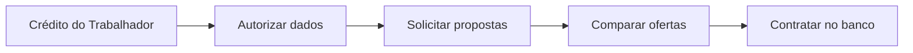
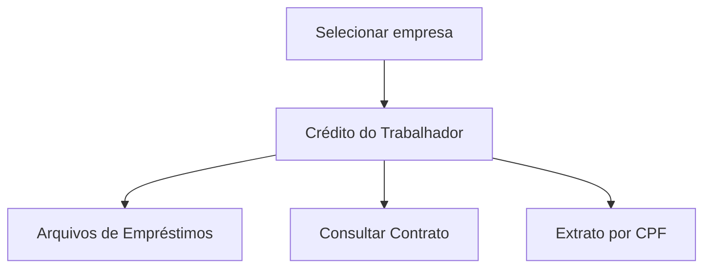
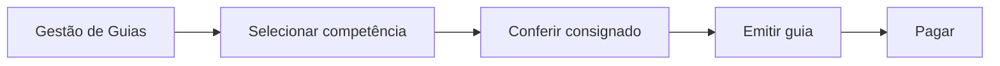

## 1. CTPS Digital — visão do trabalhador

A tela apresenta funcionalidades como:

| Elemento                      | Informação                                              |
| ----------------------------- | ------------------------------------------------------- |
| **Crédito do Trabalhador**    | Acesso à solicitação de propostas                       |
| **Vínculo selecionado**       | Empresa à qual o empréstimo ficará associado            |
| **Remuneração de referência** | Informação usada no cálculo inicial da margem           |
| **Instituições financeiras**  | Bancos autorizados a oferecer propostas                 |
| **Propostas recebidas**       | Valor liberado, parcela, prazo, taxa e CET              |
| **Contratos**                 | Empréstimos contratados pelo trabalhador                |
| **Garantias**                 | FGTS ou verbas rescisórias oferecidas, quando aplicável |

Fluxo visual:

A formalização pode continuar no canal da instituição financeira.

## 2. DET — aviso ao empregador

O DET possui uma estrutura semelhante a uma caixa de mensagens oficial.

| Área                | Conteúdo                                      |
| ------------------- | --------------------------------------------- |
| **Caixa Postal**    | Mensagens destinadas ao empregador            |
| **Remetente**       | Ministério do Trabalho e Emprego              |
| **Assunto**         | Aviso de contratação de empréstimo consignado |
| **Estabelecimento** | CNPJ relacionado ao aviso                     |
| **Orientação**      | Consultar o Portal Emprega Brasil             |
| **Data de envio**   | Normalmente dentro do ciclo mensal            |

O DET apenas **avisa**. Ele não é a fonte principal do valor da parcela.

> Mesmo que o empregador não receba ou não leia a mensagem do DET, continua obrigado a consultar mensalmente o Portal Emprega Brasil.

Como acessar a notificação:
1. Acessar o Portal do DET: https://det.sit.trabalho.gov.br;
2. Fazer login com a conta gov.br com nível de segurança prata ou ouro;
3. No menu que será apresentado, clicar em “Caixa Postal”. Observar figura abaixo:
4. Na CAIXA POSTAL, selecionar a mensagem com o título “Aviso - Contratação de
Empréstimo Consignado no Âmbito do Programa Crédito do Trabalhador, conforme
imagem abaixo:

Ler o conteúdo da notificação e seguir as instruções complementares.
A ausência de consulta aos Avisos do DET não exime o empregador das obrigações legais de
escrituração, desconto e recolhimento. O DET apenas reforça e documenta a ciência do
empregador.
Inclusive, eventuais falhas no envio das mensagens pelo DET ou a indisponibilidade
temporária do sistema não afastam o dever do empregador de acessar o Portal Emprega Brasil e
consultar os dados disponibilizados mensalmente. A escrituração das informações no eSocial deve
ser realizada com base nos dados oficiais constantes do Portal, independentemente do
recebimento da notificação eletrônica.

Como o acesso ao DET é realizado por estabelecimento, e o sistema foi atualizado para
permitir que o usuário possa visualizar e administrar de forma centralizada as mensagens enviadas
para todas as filiais, a partir do login do CNPJ raiz do empregador. 

## 3. Portal Emprega Brasil — visão do empregador

É o principal ambiente para o empregador consultar os contratos.

### Menu principal

Passo a passo para acessar as informações do consignado no Portal Emprega Brasil:
1. Utilizar o link de acesso: https://servicos.mte.gov.br/empregador/
2. Fazer o login como representante legal da empresa utilizando sua conta gov.br:

Caso o empregador ainda não possua acesso ao Portal Emprega Brasil – Portal do
Empregador e seja o primeiro acesso, deve seguir as instruções de “Como cadastrar sua empresa”
e “Como cadastrar representantes para sua empresa”. Estas instruções estão na página inicial do
Portal Emprega Brasil.
3. Após a autenticação, será solicitado que o usuário selecione a empresa que ele está
representando neste acesso ou se está se autenticando como um Empregador Pessoa
Física, conforme tela abaixo:

4. Ao entrar no Portal, o empregador deve clicar na opção “Crédito do Trabalhador”,
conforme indicado na tela abaixo:

5. Em seguida, o empregador deve acessar as informações de consignado por meio de uma
das opções disponíveis

6. Opção Arquivos de Empréstimos (baixar arquivos): Esta opção permite baixar as
informações de contratos de empréstimo consignado de todos os trabalhadores da
empresa (matriz e filiais no mesmo arquivo) que possuem parcela de consignado a ser
paga em determinada competência. Por meio dessa opção é possível baixar os arquivos
em diversos leiautes (CSV, XLS, JSON) e ainda obter detalhes do Leiaute do Arquivo. Ao
informar ano e mês nos campos indicados e efetuar a consulta, o empregador poderá
verificar detalhes dos contratos de consignado por trabalhador. Seguem registros
exemplificativos em telas:
Adicionalmente, a funcionalidade permite ao empregador acessar o link "Leiaute do
Arquivo", por meio do qual podem ser consultadas as versões vigentes dos leiautes
disponibilizados pela Plataforma Crédito do Trabalhador.
Também é disponibilizada a funcionalidade "Exportar Consulta", permitindo ao
empregador realizar a extração das informações dos contratos em diferentes formatos,
inclusive CSV, XLSX e JSON.

7. Opção Consultar Contrato de Empréstimo. Esta opção permite consultar contrato
específico de empréstimo consignado com base no número de contrato e no código da
instituição financeira. Segue registro exemplificativo em tela:

A consulta individual do contrato permite visualizar informações adicionais da operação,
incluindo o saldo devedor atualizado e, quando houver utilização de garantias, a seção
Garantia ofertada, contendo o percentual das verbas rescisórias vinculado à operação.
Na hipótese de inexistência de utilização das verbas rescisórias como garantia, o sistema
apresentará percentual correspondente igual a 0% (zero por cento).

8. Opção Extrato de Empréstimo: Esta opção permite consultar o contrato específico de
empréstimo consignado com base no CPF de um determinado trabalhador. Segue registro
exemplificativo em tela:

*Inclusão da “Garantia ofertada” e exibição do percentual ofertado para Verbas
rescisórias. *Inclusão do campo “Saldo devedor” e seu respectivo valor. NOTA: Quando
não há oferta da garantia para "Verbas rescisórias", será exibido 0%.
O extrato de empréstimos passa a apresentar, adicionalmente, o saldo devedor atualizado da
operação e, quando aplicável, as informações relativas às garantias vinculadas ao contrato.
Na hipótese de inexistência de utilização das verbas rescisórias como garantia, será
apresentado percentual correspondente igual a 0% (zero por cento).
Além do acesso pelo Portal Web do Emprega Brasil acima informado, também foi desenvolvido
um processo de acesso automatizado via webservice (API) para que os empregadores possam
buscar as informações na Plataforma Crédito do Trabalhador diretamente pelos sistemas de folha
de pagamento. 

### Arquivos de Empréstimos

| Campo ou função        | Utilização                                  |
| ---------------------- | ------------------------------------------- |
| **Ano**                | Ano da competência                          |
| **Mês**                | Mês do desconto                             |
| **Consultar**          | Localiza os contratos da competência        |
| **Exportar**           | Gera arquivos CSV, XLSX ou JSON             |
| **Leiaute do arquivo** | Apresenta a estrutura técnica dos dados     |
| **Matriz e filiais**   | Contratos podem ser consolidados no arquivo |

### Consulta de contrato

| Informação apresentada | Exemplo                                            |
| ---------------------- | -------------------------------------------------- |
| CPF                    | Trabalhador relacionado                            |
| Número do contrato     | Identificador da operação                          |
| Instituição financeira | Banco que concedeu o crédito                       |
| Valor da parcela       | Valor previsto para desconto                       |
| Competência            | Mês em que deve ocorrer o desconto                 |
| Saldo devedor          | Valor ainda devido                                 |
| Garantia ofertada      | Percentual de verbas rescisórias, quando aplicável |

Os arquivos são disponibilizados mensalmente, normalmente entre os dias **21 e 25**. [Manual oficial do empregador — versão 2.1, páginas 7 a 16](https://www.gov.br/trabalho-e-emprego/pt-br/assuntos/credito-do-trabalhador/empregador/manual-operacional-do-empregador)

## 4. eSocial — escrituração da rubrica

No eSocial, o empregador não consulta a proposta do empréstimo. Ele registra o valor efetivamente descontado.

### Tela da Tabela de Rubricas — S-1010

| Campo                     | Preenchimento esperado          |
| ------------------------- | ------------------------------- |
| Código da rubrica         | Código criado pela empresa      |
| Descrição                 | Desconto Crédito do Trabalhador |
| Tipo                      | Desconto                        |
| Natureza da rubrica       | `9253`                          |
| Incidência FGTS           | `31`                            |
| Incidência previdenciária | `00`                            |
| Incidência de IRRF        | `9`                             |

### Evento de remuneração

| Campo                            | Informação                                   |
| -------------------------------- | -------------------------------------------- |
| Trabalhador                      | CPF/matrícula                                |
| Competência                      | Mês da folha                                 |
| Rubrica                          | Código interno relacionado à natureza `9253` |
| Valor descontado                 | Valor efetivamente retirado da remuneração   |
| Código da instituição financeira | Identificador do banco                       |
| Número do contrato               | Identificador da operação                    |
| Outras informações               | Campo complementar opcional                  |

Os principais eventos são:

* `S-1200`: folha mensal;
* `S-2299`: desligamento;
* `S-2399`: término de trabalhador sem vínculo.

O eSocial gera o totalizador `S-5003`, posteriormente lido pelo FGTS Digital.

## 5. FGTS Digital — geração da guia

O FGTS Digital apresenta os débitos originados pelo eSocial.

### Gestão de Guias

| Elemento da tela          | Função                                                |
| ------------------------- | ----------------------------------------------------- |
| **Competência**           | Seleciona o mês de referência                         |
| **FGTS mensal**           | Valores de FGTS da folha                              |
| **FGTS rescisório**       | Valores relacionados ao desligamento                  |
| **Empréstimo consignado** | Parcelas declaradas no eSocial                        |
| **Guia Rápida**           | Gera uma guia com os débitos selecionados             |
| **Guia Parametrizada**    | Permite escolher trabalhadores ou débitos específicos |
| **Consignado vencido**    | Gera guia de parcelas atrasadas, quando aplicável     |
| **Emitir guia**           | Produz o documento para pagamento                     |

Após o pagamento, o FGTS Digital comunica a Caixa, que identifica os valores e realiza o repasse às instituições financeiras.

Detalhamento do processo de Emissão da GUIA RÁPIDA 

Detalhamento do Processo de Emissão da GUIA PARAMETRIZADA

Na Etapa 1, o empregador deverá selecionar os débitos de FGTS que deseja incluir na guia,
conforme os filtros de pesquisa disponíveis no sistema. Caso não haja valores de FGTS a recolher
na competência em questão, mas existam parcelas de empréstimo consignado, o usuário deverá
clicar no botão “Avançar”, mesmo que nenhum débito de FGTS seja exibido nessa primeira Etapa.
Em seguida, na Etapa 2, será possível selecionar os débitos de empréstimo consignado a serem
incluídos na guia e, então, prosseguir para a próxima Etapa.
A Etapa 2 (Selecionar Débitos Consignados) foi incluída no sistema como novidade para
viabilizar o pagamento das parcelas de empréstimo consignado no âmbito do Programa Crédito do
Trabalhador. Nessa Etapa, os débitos de consignado são incluídos automaticamente, desde que, na
Etapa 1, tenham sido selecionados débitos de FGTS relativos a trabalhadores que também possuem
parcelas de empréstimo consignado a serem recolhidas.
Na tela inicial de apresentação da Etapa 2, os débitos de consignado que foram incluídos
automaticamente não são exibidos detalhadamente, mas são apresentados em um relatórioresumo, que informa a quantidade total de débitos de consignado incluídos automaticamente, a 
quantidade de trabalhadores com consignado e o valor total de consignado. Abaixo, segue tela
ilustrativa do quadro-resumo:

Ainda na Etapa 2, se o empregador desejar visualizar ou selecionar quais débitos de
consignado serão incluídos na guia, deverá utilizar o botão pesquisar, informando os critérios de
pesquisa desejados. O sistema, então, exibirá tanto os débitos já incluídos automaticamente
quanto as demais opções que atendem aos filtros aplicados. E então será possível adicionar ou
excluir débitos de empréstimo consignado à guia. Segue tela ilustrativa da ferramenta de pesquisa:

A ferramenta de pesquisa da Etapa 2 (Selecionar Débitos Consignados) recupera
automaticamente os débitos de consignados referentes à competência atual e à anterior, desde que
estejam devidamente escriturados, não tenham sido pagos e ainda não estejam vencidos.
As Etapas 1 e 2 permitem ao empregador realizar a gestão completa dos débitos que irão
compor a guia, com a possibilidade de incluir ou excluir débitos, tanto de FGTS quanto de
empréstimo consignado.
Apresenta-se, a seguir, o registro da tela correspondente à Etapa 2 da funcionalidade de
Emissão da Guia Parametrizada:

Na Etapa 3, ocorre a definição da data de vencimento da guia. Nesse momento, o sistema
exibe duas abas distintas: uma com os valores de FGTS incluídos na guia e outra com os valores de
empréstimo consignado.
Ao configurar uma guia contendo débitos de FGTS e de empréstimo consignado, a data de
vencimento da guia deverá corresponder à data mais antiga entre os vencimentos dos débitos de
consignado incluídos, uma vez que o sistema não permite o agendamento de pagamento dessas
parcelas após o vencimento legal.
Ainda nessa fase, o sistema permite realizar ajustes, como a exclusão de débitos previamente
selecionados, possibilitando ao empregador optar pela geração de guias mistas — contendo débitos
de FGTS e de consignado — ou, se preferir, guias específicas, com débitos exclusivamente de uma
dessas naturezas.
Havendo alguma alteração na lista de débitos a ser incluída na guia, a data de vencimento será
recalculada para refletir a nova situação. As opções disponíveis para alteração de vencimento
estarão acessíveis no campo “Vencimento da Guia”.
Segue registro da tela correspondente à Etapa 3: 

Na Etapa 4, o empregador poderá visualizar o resumo dos valores consolidados que compõem
a guia, incluindo os débitos de FGTS e de empréstimo consignado. Após conferir as informações,
deverá clicar no botão “Emitir Guia” para gerar o documento de pagamento.
Segue registro da tela correspondente à Etapa 4: 

FGTS Digital permite a emissão de relatórios em PDF com informações detalhadas sobre os
recolhimentos efetuados. Além dos modelos já disponíveis com dados relativos aos valores de
FGTS, foi incluído um novo relatório específico com o detalhamento das parcelas de empréstimo
consignado incluídas nas guias geradas e efetivamente pagas.
O empregador pode, caso deseje, baixar esses relatórios diretamente pelo sistema, utilizando
o ícone correspondente disponível em tela. Os documentos emitidos permitem a visualização clara
dos valores consignados incluídos em cada guia, o que facilita o controle e o acompanhamento da
regularidade dos repasses.
A seguir, apresenta-se um exemplo ilustrativo de relatório em formato PDF, contendo o
detalhamento dos débitos relacionados ao empréstimo consignado. 

## 6. Plataforma Crédito do Trabalhador — bastidor central

Ela não funciona como uma tela única para todos os participantes.

| Participante               | Onde visualiza seus dados                      |
| -------------------------- | ---------------------------------------------- |
| **Trabalhador**            | CTPS Digital e canal da instituição financeira |
| **Empregador**             | Portal Emprega Brasil                          |
| **Instituição financeira** | APIs disponibilizadas pela Dataprev            |
| **Governo**                | Plataforma e integrações administrativas       |
| **Sistema de folha**       | Webservice/API para obter parcelas             |
| **eSocial**                | Recebe o valor efetivamente descontado         |

A plataforma centraliza:

* averbação;
* contrato;
* instituição financeira;
* parcela;
* competência;
* saldo devedor;
* renegociação;
* portabilidade;
* quitação;
* garantias.

  

## Onde encontrar as imagens oficiais

No [Manual de Orientação do Empregador — versão 2.1](https://www.gov.br/trabalho-e-emprego/pt-br/assuntos/credito-do-trabalhador/empregador/manual-operacional-do-empregador), os exemplos de telas estão distribuídos assim:

| Sistema                  | Páginas aproximadas |
| ------------------------ | ------------------: |
| DET                      |                 5–6 |
| Portal Emprega Brasil    |                8–16 |
| eSocial e rubrica `9253` |               17–18 |
| FGTS Digital             |               20–29 |
| DAE do eSocial           |               29–30 |

Essas imagens são as melhores referências porque fazem parte do manual oficial atualizado em junho de 2026.
