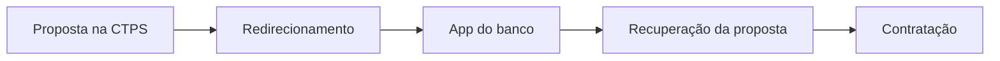
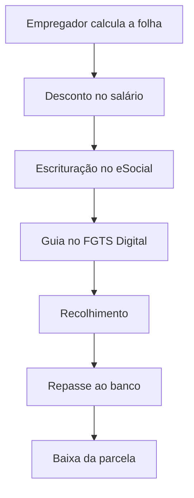
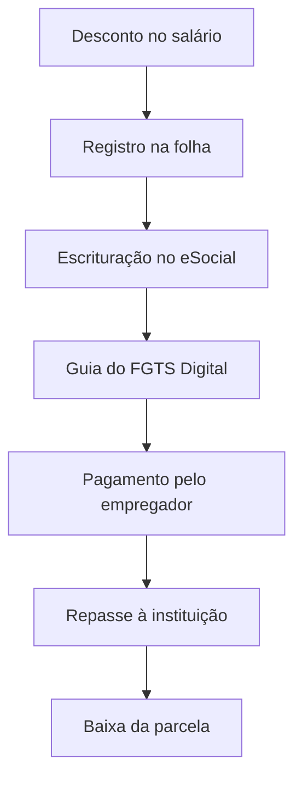

## Existe um levantamento específico por banco?

Existem dados públicos, mas há uma limitação importante: **não encontrei um ranking oficial que isole exclusivamente as reclamações do Crédito do Trabalhador por banco**.

As principais fontes disponíveis são:

1. **Banco Central:** publica ranking por instituição, porém engloba todos os produtos do banco — cartão, conta, Pix, empréstimos, consignado etc.
2. **Consumidor.gov.br:** permite filtrar reclamações por banco, assunto, problema e palavras-chave. É a melhor fonte para montar um estudo específico.
3. **Procons:** publicam pesquisas e casos, mas nem sempre segregam o Crédito do Trabalhador.
4. **Reclame Aqui:** ajuda a identificar dores qualitativas, mas não deve ser usado como ranking estatístico, pois os relatos são espontâneos e não representam necessariamente toda a base de clientes.
5. **MTE:** disponibiliza dados sobre falhas operacionais de empregadores, eSocial e FGTS Digital.

## Ranking geral de reclamações bancárias

No ranking do Banco Central do segundo trimestre de 2026, as instituições relevantes para o consignado privado apareceram assim:

| Instituição           | Índice de reclamações do BC |
| --------------------- | --------------------------: |
| Bradesco              |                       84,90 |
| C6 Bank               |                       59,77 |
| Itaú                  |                       46,87 |
| BTG Pactual/Banco PAN |                       41,98 |
| PicPay                |                       35,66 |
| Santander             |                       34,19 |
| Banco do Brasil       |                       32,68 |
| Banco Inter           |                       26,15 |
| Caixa                 |                       23,32 |
| Nu Pagamentos/Nubank  |                        9,20 |

Fonte: [Ranking de Reclamações do Banco Central — 2º trimestre de 2026](https://www.bcb.gov.br/ranking/index.asp?frame=1&rel=outbound).

**Atenção:** esse ranking não significa que o Bradesco seja necessariamente o banco com mais reclamações de Crédito do Trabalhador. Ele representa o conjunto dos produtos de cada instituição. O próprio ranking, porém, coloca problemas relacionados à integridade, segurança e legitimidade de operações consignadas entre os assuntos mais recorrentes.

---

# Principais reclamações do Crédito do Trabalhador

## 1. Empréstimo ou desconto não reconhecido

O cliente percebe um contrato ou desconto no salário que afirma não ter autorizado.

As situações relatadas incluem:

* contrato que o cliente diz não reconhecer;
* migração de um consignado antigo para o novo modelo sem comunicação compreensível;
* retomada do desconto depois de um novo emprego;
* desconto nas férias, rescisão ou folha em valor inesperado;
* abordagem de correspondentes pelo WhatsApp;
* dúvida sobre quem é o verdadeiro banco credor.

Essa é uma reclamação de alta criticidade porque o cliente pode interpretar uma migração regulamentar ou uma reativação contratual como fraude — ou pode realmente ter sido vítima de fraude.

Há relatos públicos relacionados ao [Santander](https://www.reclameaqui.com.br/santander/reclamacao-desconto-indevido-em-folha-credito-do-trabalhador_ilC1SLJvxLrB-qQx/) e ao [Bradesco](https://www.reclameaqui.com.br/bradesco/migracao-automatica-de-emprestimo-consignado-para-credito-do-trabalhador-sem-autorizacao_KLOBb7M7X0MAxKOE/). Esses relatos são alegações de consumidores, não conclusões oficiais contra as instituições.

O Idec também alerta para [ofertas de crédito enviadas sem solicitação pelo WhatsApp](https://idec.org.br/idec-na-imprensa/ofertas-de-credito-chegam-sem-solicitacao-por-whatsapp), algumas delas usando o nome do Crédito do Trabalhador como argumento de venda.

### Fricção de produto

O problema central é a ausência de uma trilha clara mostrando:

* quando o contrato foi assinado;
* em qual canal;
* qual dispositivo foi utilizado;
* qual biometria ou autenticação foi realizada;
* se houve migração, portabilidade ou reativação;
* por que o desconto apareceu naquele vínculo;
* quem é a instituição credora atual.

---

## 2. Proposta aparece na CTPS Digital, mas não aparece no banco

O trabalhador recebe uma proposta na Carteira de Trabalho Digital e, ao tocar para contratar, é enviado para o aplicativo do banco. No aplicativo:

* o produto não aparece;
* a proposta não é encontrada;
* o cliente cai na tela inicial;
* aparece um erro genérico;
* o banco não reconhece o identificador da proposta;
* a proposta expira antes da contratação.

Há exemplo público envolvendo o [Banco do Brasil](https://www.reclameaqui.com.br/banco-do-brasil/nao-consigo-contratar-credito-do-trabalhador_Y3uJ21ivF8bQv5KV/) e relatos semelhantes envolvendo outros bancos.

### Fricção de produto

É uma falha de **handoff**, ou seja, de passagem entre sistemas:

Se o identificador, a autenticação ou o contexto da proposta não acompanha o cliente, ele precisa recomeçar a jornada ou procurar atendimento.

---

## 3. Erro de elegibilidade ou ausência de oferta

O trabalhador acredita que tem direito ao produto, mas recebe mensagens como:

* “vínculo não encontrado”;
* “produto indisponível”;
* “não elegível”;
* “margem insuficiente”;
* “dados indisponíveis na Dataprev”;
* “não há ofertas disponíveis”;
* “você já possui contrato neste vínculo”.

O problema é que o sistema normalmente informa apenas o resultado, sem explicar a causa.

### Possíveis causas

* vínculo trabalhista ainda não atualizado;
* remuneração não informada corretamente;
* margem já comprometida;
* contrato anterior ocupando a margem;
* divergência entre CPF, matrícula, vínculo ou CNPJ;
* política de crédito do banco;
* indisponibilidade temporária da Dataprev;
* banco não oferece o produto para aquele perfil.

### Fricção de produto

O cliente não consegue distinguir:

> “O governo diz que não sou elegível”
> de
> “O banco analisou meu perfil e decidiu não conceder crédito”.

Essa diferença deveria aparecer claramente na interface.

---

## 4. Biometria, selfie e assinatura falham

São relatados problemas como:

* selfie não reconhecida;
* biometria rejeitada repetidamente;
* câmera não abre;
* documento não é aceito;
* erro após a aprovação;
* contratação volta para o início;
* proposta fica presa entre “aprovada” e “assinada”.

Há relato público envolvendo o [Banco PAN](https://www.reclameaqui.com.br/banco-pan/erro-ao-finalizar-emprestimo-clt-no-app-banco-pan-apos-aprovacao-devido-a-erro-inesperado-na-selfie_anHN00v-IQDO4S8X/).

### Fricção de produto

É necessário equilibrar prevenção a fraude e conversão. Uma biometria rigorosa pode reduzir fraude, mas, sem recuperação assistida, aumenta abandono e exclui clientes com:

* aparelhos mais antigos;
* câmera de baixa qualidade;
* baixa conectividade;
* documentos antigos;
* pouca familiaridade digital.

---

## 5. Contrato ativo, mas dinheiro não liberado

O cliente vê o contrato como “ativo” ou “averbado”, mas o dinheiro ainda não entrou na conta.

Exemplos de reclamações públicas envolvem [Caixa](https://www.reclameaqui.com.br/caixa-economica-federal/emprestimo-consignado-clt-ativo-mas-nao-cai-o-dinheiro-na-conta_hrKDu38ekLnWg6dg/) e [Banco PAN](https://www.reclameaqui.com.br/banco-pan/credito-trabalhador-nao-creditado_k7IAc2uMkbD-nKk5/).

### Possíveis causas

* averbação realizada antes da liquidação financeira;
* conta de destino com problema;
* divergência cadastral;
* processamento bancário pendente;
* análise antifraude adicional;
* inconsistência entre Dataprev e banco;
* falha no retorno de status para a CTPS.

### Fricção de produto

Termos como “aprovado”, “contratado”, “averbado”, “liquidado” e “pago” aparecem como se fossem equivalentes, mas representam etapas diferentes.

O status deveria informar:

* etapa atual;
* responsável;
* prazo esperado;
* pendência existente;
* ação necessária do cliente.

---

## 6. Demora na análise e ausência de prazo

O cliente envia a proposta e fica dias com mensagens como:

* “em análise”;
* “processando”;
* “aguarde”;
* “estamos validando seus dados”.

Não há prazo nem explicação sobre a pendência. Há exemplos públicos envolvendo [Caixa](https://www.reclameaqui.com.br/caixa-economica-federal/demora-na-analise-e-falta-de-resposta-sobre-emprestimo-consignado-clt-na-caixa_kY9V6o4ad5nWxcMp/) e [PicPay](https://www.reclameaqui.com.br/picpay-bank-banco-multiplo/emprestimo-clt-picpay-em-analise-demora-na-liberacao-e-falta-de-resposta_K9odi4B8pz1ndpop/).

### Fricção de produto

O cliente não sabe se:

* foi reprovado;
* precisa enviar algo;
* o banco está indisponível;
* a Dataprev não respondeu;
* a proposta expirará;
* o dinheiro ainda será liberado.

O problema não é apenas a demora, mas a falta de previsibilidade.

---

## 7. Desconto realizado, mas banco não reconhece o pagamento

Essa é uma das dores mais graves:

1. a parcela aparece descontada no holerite;
2. o banco não recebe ou não concilia o valor;
3. a parcela continua em aberto;
4. o cliente recebe cobrança;
5. em alguns casos, ocorre negativação.

O MTE encontrou um problema operacional relevante: na competência de setembro de 2025, aproximadamente **95 mil empresas deixaram de realizar os descontos informados pela Dataprev** e quase **70 mil descontaram dos trabalhadores, mas não recolheram o valor no prazo pelo FGTS Digital**. [Veja o comunicado oficial do MTE](https://www.gov.br/trabalho-e-emprego/pt-br/servicos/empregador/fgtsdigital/comunicados/mte-inicia-a-cobranca-das-empresas-que-nao-estao-declarando-ou-recolhendo-as-prestacoes-de-emprestimo-consignado).

Isso demonstra que a reclamação pode surgir no banco, mas a origem pode estar em diferentes pontos:

Uma falha em qualquer etapa pode produzir a percepção de que “o banco cobrou duas vezes”.

---

## 8. Valor da parcela diferente ou desconto parcial

O cliente reclama quando:

* o desconto é menor que a parcela contratada;
* o desconto não acontece;
* o saldo restante é cobrado por boleto;
* há cobrança de encargos;
* o valor muda sem explicação;
* o desconto compromete mais renda do que o esperado.

Isso pode ocorrer quando a remuneração disponível do mês não suporta a parcela integral, por exemplo, em situações de:

* faltas;
* afastamento;
* redução de salário;
* férias;
* adiantamentos;
* outros descontos legais;
* desligamento;
* mudança de vínculo.

O [Manual Operacional do Crédito do Trabalhador](https://www.gov.br/trabalho-e-emprego/pt-br/assuntos/credito-do-trabalhador/empregador/manual-operacional-do-empregador) trata expressamente de desconto parcial, falta de saldo, transferência de trabalhadores, rescisão e divergências de pagamento.

### Fricção de produto

O cliente normalmente só descobre o desconto parcial depois do fechamento da folha. Deveria receber comunicação antecipada explicando:

* valor previsto;
* valor efetivamente descontado;
* diferença em aberto;
* existência de juros ou encargos;
* como regularizar;
* impacto nas próximas parcelas.

---

## 9. Migração, portabilidade e refinanciamento confusos

As reclamações incluem:

* contrato antigo migrado automaticamente;
* parcela ou quantidade de parcelas aparentemente alterada;
* margem não liberada depois da quitação;
* dificuldade para portar o contrato;
* banco antigo demora para enviar o saldo devedor;
* cliente não sabe quem é o credor atual;
* contrato desaparece ou aparece duplicado nos canais;
* refinanciamento indisponível sem explicação.

Há relatos públicos sobre [migração no Bradesco](https://www.reclameaqui.com.br/bradesco/migracao-de-emprestimo-consignado-sem-beneficios-e-alteracao-contratual-pelo-bradesco_W7W3G2CF53jVz3cP/) e [portabilidade no Itaú](https://www.reclameaqui.com.br/itau/dificuldade-na-portabilidade-de-emprestimo-consignado_VxiJmLtcxVXFSB2N/).

### Fricção de produto

A tela deveria mostrar uma linha do tempo contratual:

* contrato original;
* eventual migração;
* portabilidade;
* instituição anterior;
* instituição atual;
* taxa anterior e nova;
* saldo antes e depois;
* quantidade de parcelas;
* margem liberada ou consumida.

---

## 10. Atendimento sem dono do problema

O cliente fala com o banco e recebe orientações como:

* “procure o RH”;
* “é responsabilidade da Dataprev”;
* “fale com o governo”;
* “o eSocial ainda não atualizou”;
* “o banco não recebeu o repasse”;
* “procure a Carteira de Trabalho Digital”.

O RH, por sua vez, pode direcioná-lo novamente ao banco.

O manual do MTE confirma que existem responsabilidades distribuídas entre Plataforma Crédito do Trabalhador, DET, Portal Emprega Brasil, eSocial, FGTS Digital, Dataprev, empregador e instituição financeira. Para problemas de contratação ou execução do contrato — valores divergentes, atraso, pagamento errado e situações semelhantes — o direcionamento é para a instituição financeira. [Manual do MTE, seção de atendimento](https://www.gov.br/trabalho-e-emprego/pt-br/assuntos/credito-do-trabalhador/empregador/manual-operacional-do-empregador).

As instituições habilitadas também devem acompanhar diariamente o Consumidor.gov.br e responder às reclamações em até dez dias. [Portaria MTE nº 434/2025](https://www.gov.br/trabalho-e-emprego/pt-br/assuntos/legislacao/portarias-1/portarias-vigentes-3/PDFPortariaMTEn434de20demarode2025compiladaem06.01.2026.pdf).

---

# Síntese por banco: sinais qualitativos encontrados

A tabela abaixo representa **temas encontrados em relatos públicos**, não um ranking estatístico específico do produto.

| Banco           | Sinais de reclamação encontrados                                                                 |
| --------------- | ------------------------------------------------------------------------------------------------ |
| Bradesco        | Migração de contratos antigos, falta de transparência, baixa de parcelas, margem e portabilidade |
| Santander       | Desconto considerado indevido, migração, reativação em novo vínculo e primeira parcela           |
| Itaú            | Disponibilidade do produto, portabilidade, refinanciamento e visualização de contratos migrados  |
| Banco do Brasil | Proposta da CTPS não recuperada no aplicativo e falha no redirecionamento                        |
| Caixa           | Demora na análise, contrato ativo sem desembolso e dificuldade de fazer nova simulação           |
| Banco PAN       | Dados indisponíveis, falha de selfie/biometria e atraso na liberação                             |
| PicPay          | Proposta presa em análise, pré-aprovação sem liberação e dúvidas sobre desconto                  |
| Nubank          | Produto indisponível, erro de simulação, contrato antigo bloqueando margem                       |
| C6 Bank         | Divergência entre desconto em folha, baixa da parcela, cobrança e negativação                    |

---

# Como eu priorizaria as fricções como PM

## Prioridade 0 — dano financeiro e confiança

* contrato não reconhecido;
* desconto indevido;
* desconto feito, mas não reconhecido pelo banco;
* cobrança duplicada;
* negativação por falha de conciliação;
* fraude e uso indevido de dados.

## Prioridade 1 — conclusão da contratação

* proposta perdida entre CTPS e banco;
* erro de elegibilidade;
* biometria;
* contrato ativo sem desembolso;
* proposta eternamente “em análise”.

## Prioridade 2 — transparência

* motivo da recusa;
* status da proposta;
* primeira data de desconto;
* CET e valor total;
* margem utilizada;
* diferença entre desconto parcial e parcela em atraso;
* explicação da migração ou reativação.

## Prioridade 3 — gestão do contrato

* portabilidade;
* refinanciamento;
* quitação;
* liberação de margem;
* mudança de emprego;
* desligamento;
* histórico de pagamentos.

# Métricas que eu acompanharia

| Dimensão      | Métrica                                                  |
| ------------- | -------------------------------------------------------- |
| Reclamações   | Reclamações por 10 mil contratos desembolsados           |
| Confiança     | Taxa de contratos ou descontos não reconhecidos          |
| Conciliação   | Percentual descontado na folha, mas não baixado no banco |
| Conversão     | Conversão CTPS → aplicativo do banco                     |
| Biometria     | Taxa de falha e de recuperação da biometria              |
| Processamento | Propostas paradas acima do SLA                           |
| Desembolso    | Tempo entre assinatura, averbação e depósito             |
| Folha         | Desconto integral, parcial e não realizado               |
| Atendimento   | Resolução no primeiro contato                            |
| Atendimento   | Recontato em 7 e 30 dias                                 |
| Reclamações   | Tempo médio de solução                                   |
| Resultado     | Percentual resolvido no Consumidor.gov.br                |
| Risco         | Negativações causadas por falha operacional              |
| Manutenção    | Tempo de baixa após quitação ou portabilidade            |

A conclusão mais importante é: **a principal dor não está apenas na concessão do crédito; está na falta de visibilidade e de conciliação entre CTPS, banco, Dataprev, empregador, folha, eSocial e FGTS Digital**. Para o cliente, todos esses participantes formam um único produto. Portanto, mesmo quando a causa não está no banco, a experiência exige que alguém assuma a responsabilidade pelo caso até a resolução.

Os bancos dão essas respostas porque o Crédito do Trabalhador não é operado apenas pelo banco. Ele depende de uma cadeia formada por banco, Dataprev, Plataforma Crédito do Trabalhador, empregador, folha de pagamento, eSocial e FGTS Digital.

Portanto, algumas vezes o banco realmente não controla a origem da falha. Porém, em outras, o direcionamento serve para **transferir a responsabilidade e encerrar o atendimento sem investigar o caso**.

## Como a responsabilidade está distribuída

| Problema relatado                                  | Responsável principal                      | O que o banco deveria fazer                                                          |
| -------------------------------------------------- | ------------------------------------------ | ------------------------------------------------------------------------------------ |
| Proposta não aparece na CTPS Digital               | Plataforma Crédito do Trabalhador/Dataprev | Verificar se enviou corretamente a proposta e informar o status                      |
| Proposta aparece na CTPS, mas some no app do banco | Banco                                      | Recuperar a proposta ou oferecer uma jornada alternativa                             |
| Cliente não possui ofertas                         | Banco, se for decisão de crédito           | Informar que foi uma decisão da instituição, sem culpar o governo                    |
| Vínculo ou remuneração desatualizados              | Empregador/eSocial/Dataprev                | Informar exatamente qual dado está divergente                                        |
| Margem incorreta ou indisponível                   | Dataprev, banco ou contrato anterior       | Identificar qual contrato consome a margem                                           |
| Contrato assinado e dinheiro não depositado        | Banco                                      | Resolver o desembolso e informar prazo                                               |
| Parcela não apareceu na folha                      | Empregador, sistema de folha ou eSocial    | Confirmar se o contrato foi enviado corretamente para desconto                       |
| Parcela foi descontada, mas não repassada          | Empregador/FGTS Digital                    | Conciliar o contrato e evitar cobrança indevida ao trabalhador                       |
| Valor da parcela está diferente do contrato        | Banco, empregador ou folha                 | Comparar contrato × arquivo Dataprev × eSocial × valor recolhido                     |
| Contrato ou desconto não reconhecido               | Banco                                      | Abrir contestação, apresentar evidências da contratação e bloquear efeitos indevidos |
| Migração, portabilidade ou refinanciamento         | Instituições financeiras envolvidas        | Informar origem, destino, saldo, taxa, parcelas e andamento                          |
| Margem não liberada após quitação                  | Banco/Dataprev                             | Dar baixa no contrato e liberar a margem                                             |
| Erro na escrituração da rubrica 9253               | Empregador/eSocial                         | Orientar o RH sobre a inconsistência técnica                                         |
| Guia não gerada ou não paga                        | Empregador/FGTS Digital                    | Identificar se houve desconto e orientar a regularização                             |

O [Manual do Crédito do Trabalhador do MTE](https://www.gov.br/trabalho-e-emprego/pt-br/assuntos/credito-do-trabalhador/empregador/manual-operacional-do-empregador) reconhece essa divisão de responsabilidades, mas também determina que problemas de contratação e execução do contrato — como divergência de valores, atraso e pagamento errado — sejam tratados diretamente com a instituição financeira.

## Por que o banco manda “procurar o RH”?

Porque o empregador é responsável por:

1. consultar os contratos e parcelas previstos;
2. calcular a remuneração disponível;
3. realizar o desconto;
4. registrar o valor no eSocial;
5. gerar e pagar a guia pelo FGTS Digital ou DAE.

Quando o banco não recebe o pagamento, uma possibilidade é o RH ter:

* deixado de descontar;
* usado uma rubrica errada;
* informado valor incorreto no eSocial;
* descontado, mas não pago a guia;
* pago a guia depois do vencimento;
* vinculado o desconto ao contrato ou trabalhador errado.

Em setembro de 2025, o MTE identificou cerca de **95 mil empregadores que não fizeram o desconto previsto** e quase **70 mil que descontaram do salário, mas não recolheram o valor no prazo**. Portanto, essa causa operacional é real. [Veja o comunicado oficial do MTE](https://www.gov.br/trabalho-e-emprego/pt-br/servicos/empregador/fgtsdigital/comunicados/mte-inicia-a-cobranca-das-empresas-que-nao-estao-declarando-ou-recolhendo-as-prestacoes-de-emprestimo-consignado).

Porém, dizer apenas “procure o RH” é insuficiente. O banco deveria informar:

> “A parcela da competência 07/2026 não foi localizada em nosso processo de conciliação. Verificamos que o contrato foi enviado para desconto, mas o repasse ainda não foi identificado. Solicite ao RH o comprovante da guia e informe este protocolo.”

Isso é muito diferente de simplesmente encerrar o atendimento.

## Por que o banco culpa a Dataprev?

A Dataprev opera parte importante da infraestrutura e da troca de informações, como:

* dados de vínculos trabalhistas;
* margem consignável;
* registro e averbação dos contratos;
* informações mensais das parcelas;
* comunicação entre a plataforma e as instituições;
* atualização de encerramentos, suspensões e novos vínculos.

Uma indisponibilidade ou inconsistência pode realmente impedir:

* consulta de margem;
* averbação;
* recuperação da proposta;
* atualização do vínculo;
* baixa do contrato;
* liberação da margem;
* redirecionamento para um novo emprego.

Mas o cliente não tem acesso técnico à Dataprev. Portanto, dizer “fale com a Dataprev” geralmente é um encaminhamento ruim. Quem se integra tecnicamente com a Dataprev é o banco — não o trabalhador.

O correto seria o banco abrir uma ocorrência técnica, informar o identificador da transação e acompanhar o retorno.

## Por que dizem “o eSocial não atualizou”?

O eSocial recebe do empregador as informações da folha e da rubrica específica do consignado privado, de natureza **9253**.

Se o empregador:

* não enviar a folha;
* enviar depois do prazo;
* usar uma rubrica incompatível;
* informar contrato ou instituição incorretamente;
* retificar uma folha já paga;
* registrar valor diferente do esperado;

pode haver divergência no processo.

Entretanto, o eSocial não aprova o empréstimo e não deposita dinheiro na conta. Ele é responsável pela **escrituração das informações trabalhistas e do desconto**.

Por isso, “o eSocial não atualizou” é uma explicação genérica. O atendimento deveria dizer:

* qual competência está divergente;
* qual evento do eSocial está envolvido;
* qual valor era esperado;
* qual valor foi informado;
* se a pendência bloqueia desconto, recolhimento ou conciliação.

## Por que dizem “o banco não recebeu o repasse”?

Essa situação pode acontecer mesmo quando a parcela aparece no holerite:

O holerite comprova que houve desconto, mas não comprova sozinho que o empregador:

* declarou corretamente;
* gerou a guia;
* pagou a guia;
* pagou no prazo;
* vinculou corretamente o contrato;
* teve o pagamento conciliado pelo banco.

Mas há uma regra importante: **se o empregador descontou do salário e não recolheu, a responsabilidade pela falta de repasse não deve ser transferida automaticamente ao trabalhador**. O empregador responde pela regularização e pelos encargos decorrentes do atraso.

O banco precisa evitar:

* cobrar novamente o trabalhador sem investigar;
* considerar a parcela inadimplente automaticamente;
* incluir juros indevidos;
* negativar o cliente por falha de repasse;
* exigir que o cliente resolva sozinho com o RH.

## Por que mandam procurar a Carteira de Trabalho Digital?

Esse direcionamento pode fazer sentido quando o problema está em:

* solicitação inicial de propostas;
* consentimento para compartilhamento de dados;
* exibição das propostas;
* consulta dos contratos;
* portabilidade iniciada na plataforma;
* erro geral da funcionalidade governamental.

Mas deixa de fazer sentido quando:

* a proposta já foi escolhida e o app do banco falhou;
* o contrato foi assinado;
* o banco não desembolsou;
* existe divergência contratual;
* o cliente contesta uma contratação;
* o banco não deu baixa;
* o atendimento não consegue explicar o contrato.

Nesses casos, a instituição financeira continua sendo responsável pela contratação e pela execução do contrato.

## O problema real: falta de visão ponta a ponta

Cada participante enxerga apenas uma parte:

* o banco vê contrato, desembolso e recebimento;
* a Dataprev vê margem, vínculos e averbação;
* o RH vê folha e holerite;
* o eSocial vê escrituração;
* o FGTS Digital vê guia e recolhimento;
* o trabalhador vê apenas o desconto no salário.

Quando não existe uma identificação única e uma visão compartilhada do contrato, cada área consegue dizer apenas:

> “No meu sistema está correto.”

Para o cliente, porém, tudo isso é um único produto.

## Quando é orientação legítima e quando é “jogo de empurra”?

| Situação                                                                 | Avaliação                        |
| ------------------------------------------------------------------------ | -------------------------------- |
| Banco identifica a origem, apresenta evidência e informa o canal correto | Encaminhamento legítimo          |
| Banco fornece número do contrato, competência, valor e protocolo         | Encaminhamento legítimo          |
| Banco acompanha o caso mesmo dependendo do RH ou Dataprev                | Boa gestão do caso               |
| Banco apenas diz “procure o RH”                                          | Jogo de empurra                  |
| Banco manda o trabalhador falar diretamente com a Dataprev               | Atendimento inadequado           |
| Banco não consegue explicar qual dado está desatualizado                 | Falta de observabilidade         |
| Cliente é transferido repetidamente entre banco, RH e governo            | Falta de ownership               |
| Banco cobra novamente uma parcela já descontada sem investigar           | Falha grave de conciliação       |
| Banco culpa o eSocial por problema de desembolso                         | Responsabilidade mal direcionada |

A síntese é: **o banco nem sempre causa o problema, mas deveria assumir a gestão do caso quando a reclamação envolve o contrato bancário**. Encaminhar pode ser necessário; abandonar o cliente, não. Para um PM, essa é uma grande oportunidade de produto: criar rastreabilidade ponta a ponta, mensagens específicas de erro e um modelo de atendimento no qual uma instituição seja dona do caso até a resolução.
